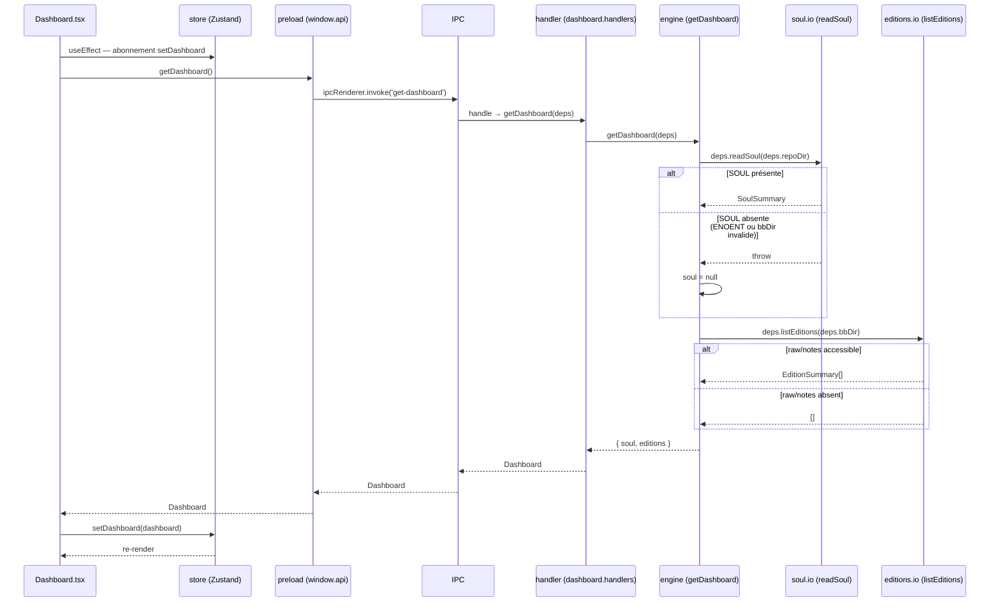

# Architecture — Module : accueil

> Module : accueil · reverse (constat) · cartographié à `4ce7095`
> Rédigé en posture Architecte Module (reverse) : chaque assertion est tracée. Le code fait foi.
> Réfère le socle global : `docs/project/architecture.md` pour la stack, les couches et le contrat IPC.

---

## Périmètre du module

| Artefact | Rôle | Trace |
|---|---|---|
| `src/renderer/pages/Dashboard.tsx` | Vue d'accueil (rendu React) | `Dashboard.tsx:1-101` |
| `src/renderer/components/EditionRow.tsx` | Composant ligne d'édition | `EditionRow.tsx:1-18` |
| `src/main/ipc/dashboard.handlers.ts` | Handler IPC `get-dashboard` | `dashboard.handlers.ts:4-5` |
| `src/main/engine.ts` `getDashboard` | Agrégation SOUL + éditions | `engine.ts:163-177` |
| `src/main/io/soul.io.ts` `readSoul` | Lecture et parsing SOUL | `soul.io.ts:33-41` |
| `src/main/io/editions.io.ts` `listEditions` | Scan `raw/notes`, tri DESC | `editions.io.ts:21-39` |
| `src/renderer/store/app.store.ts` slice `dashboard` | État dashboard dans Zustand | `app.store.ts:40,65,97,121,139` |

**Hors périmètre de ce module :**
- `dashboard.handlers.ts:6` — `read-edition` (canal `IPC.readEdition`) appartient conceptuellement au module **historique** (frontière constatée dans `_REVERSE_MODULE_MAP.md`, note de frontière GAP-M3).
- Rendu SOUL détaillé → module **soul**.

---

## Modèle de données (types TS, constatés)

```typescript
// src/main/io/soul.io.ts:12-17
interface SoulSummary {
  version: string;       // "v{lessons.length + 1}" — soul.io.ts:40
  rules: string[];       // lignes §4 Lignes rouges
  examples: SoulExample[]; // entrées §5 Échantillons vivants
  lessons: SoulLesson[]; // entrées §6 Journal d'évolution
}

// src/main/io/editions.io.ts:6-13
interface EditionSummary {
  file: string;   // nom de fichier (clé)
  date: string;   // YYYY-MM-DD extrait du nom
  range: string;  // = date (même valeur — editions.io.ts:37)
  count: number;  // nb blocs "— … —" dans le markdown
  corr: number;   // toujours 0 (GAP-06 — editions.io.ts:37)
  title: string;  // slug human-readable depuis suffixe nom fichier
}

// src/main/engine.ts:158-161
interface Dashboard {
  soul: SoulSummary | null; // null si readSoul lève (SOUL absente ou bbDir invalide)
  editions: EditionSummary[]; // [] si listEditions lève (bbDir invalide)
}
```

> `Dashboard` est le type de retour de `getDashboard` (engine) et la valeur stockée dans le slice `dashboard` du store Zustand (`app.store.ts:40`).

---

## Structure du module (par couche)

```
RENDERER
  Dashboard.tsx           — useEffect → getDashboard() au montage
  EditionRow.tsx          — composant pur (édition → onOpen callback)
  store/app.store.ts      — slice dashboard : { dashboard, setDashboard, openReader }

PRELOAD (contrat)
  window.api.getDashboard()  — src/preload/index.ts:14

IPC
  IPC.getDashboard = 'get-dashboard'  — src/shared/types/ipc.ts

MAIN
  dashboard.handlers.ts:4-5  — registerDashboardHandlers → handle('get-dashboard')
  engine.ts:163-177           — getDashboard(deps) : readSoul + listEditions (try/catch chacun)

IO
  soul.io.ts:33-41    — readSoul(baseDir) : lit {repoDir}/.claude/breves-ia/SOUL.md
  editions.io.ts:21-39 — listEditions(bbDir) : scanne {bbDir}/raw/notes/*.md, tri DESC
```

---

## Diagramme de séquence (montage Dashboard)



---

## Gestion d'état (slice `dashboard`)

Vu `src/renderer/store/app.store.ts` :

| Propriété/action | Ligne | Description |
|---|---|---|
| `dashboard: Dashboard \| null` | `:40` | État courant, `null` jusqu'à résolution de l'appel IPC |
| `setDashboard` | `:65, :121` | Setter simple : `set({ dashboard })` |
| `openReader` | `:80, :139` | Ouvre le reader : `set({ readerEdition, returnTo: 'dashboard', readerText: '', view: 'reader' })` |
| `go('goCompose')` | action partagée | Navigation vers `compose` via `navigation.ts:11` |
| `go('goHist')` | action partagée | Navigation vers `history` via `navigation.ts:11` |

> Le store Zustand est **global** (non scindé par module). Le slice `dashboard` coexiste avec tous les autres slices dans `AppState`. Voir `docs/project/architecture.md` §3.4.

---

## Contrat IPC du module

| Canal | Direction | Handler (trace) | Entrée | Sortie |
|---|---|---|---|---|
| `get-dashboard` | renderer → main | `dashboard.handlers.ts:5` | `{}` (payload vide) | `Dashboard` |

> Le canal `read-edition` (même fichier handler `dashboard.handlers.ts:6`) appartient au module **historique** — frontière conceptuelle, fichier partagé (GAP-M3).

---

## Contraintes et dépendances constatées

| Contrainte | Trace | Note |
|---|---|---|
| Dépend de `repoDir` valide pour lire SOUL | `engine.ts:166` | Si invalide → `soul = null` (silencieux) |
| Dépend de `bbDir` valide + `raw/notes/` existant pour les éditions | `editions.io.ts:23-28` | Si invalide → `[]` (silencieux, GAP-17) |
| `corr` toujours `0` | `editions.io.ts:37` | GAP-06 — champ non calculé |
| `getDashboard` est **synchrone** (pas d'`async`) | `engine.ts:163` | `readSoul` et `listEditions` sont des lectures FS synchrones bloquantes |
| `soul` agrégée mais non rendue dans `Dashboard.tsx` | `Dashboard.tsx:1-101` | GAP-M1 — champ disponible côté store, non affiché |

---

## GAPS À REMONTER (module accueil — architecture)

| # | Observation | Source |
|---|---|---|
| GAP-06 | `EditionSummary.corr` toujours `0` : champ réservé mais non implémenté | `editions.io.ts:37` |
| GAP-17 | Aucun garde-fou si `bbDir` invalide : `getDashboard` retourne un Dashboard vide sans signaler l'état cassé au renderer | `engine.ts:170-175` |
| GAP-M1 | `Dashboard.soul` agrégé dans le payload IPC et dans le store mais jamais rendu dans `Dashboard.tsx` | `Dashboard.tsx`, `app.store.ts:40` |
| GAP-M3 | `dashboard.handlers.ts` porte 2 canaux de 2 modules distincts (`get-dashboard` → accueil, `read-edition` → historique) : frontière conceptuelle non reflétée dans la structure de fichiers | `dashboard.handlers.ts:4-6`, `_REVERSE_MODULE_MAP.md` |
