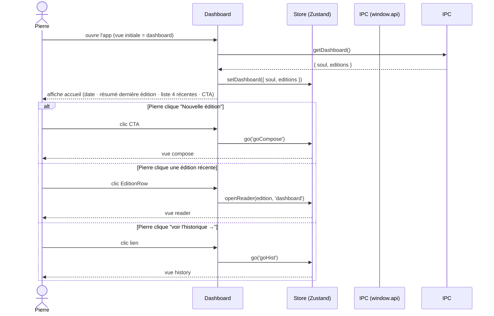

# Specs — Module : accueil

> Module : accueil · reverse (constat) · cartographié à `4ce7095`
> Rédigé en posture PO Module (reverse) : chaque assertion est tracée. Le code fait foi. Aucune conjecture.

---

## Contexte module

Le module **accueil** est la vue d'entrée de l'application (`src/domain/navigation.ts:11` — vue initiale `view: 'dashboard'` dans `src/renderer/store/app.store.ts:95`). Il agrège deux flux de données en lecture seule — le profil éditorial SOUL et l'historique des éditions archivées — pour les présenter à Pierre lors de son ouverture de l'app, et lui proposer deux points d'entrée : lancer une nouvelle édition ou consulter l'historique complet.

**Opérateur unique :** Pierre (persona global, voir `docs/project/specs.md`). Aucun multi-utilisateur, aucune authentification.

---

## User stories (constatées)

### US-ACC-01 — Voir la date courante et être accueilli

**En tant que** Pierre,  
**je veux** voir la date d'aujourd'hui et un message d'accueil en ouvrant l'app,  
**afin de** me situer dans le temps sans consulter le calendrier.

**Critères d'acceptation (constatés) :**
- La date courante est affichée en format long FR (`dateLong(new Date()…)`) — vu `src/renderer/pages/Dashboard.tsx:23`.
- Le message `Bonjour Pierre.` est affiché en dur — vu `Dashboard.tsx:31`.
- Le sous-titre `Prêt à compiler les prochaines brèves IA ?` est affiché — vu `Dashboard.tsx:32-34`.

**Cas d'erreur :** aucun (données locales, pas de dépendance réseau).

---

### US-ACC-02 — Voir le résumé de la dernière édition

**En tant que** Pierre,  
**je veux** voir les métriques de la dernière édition archivée (date, nb brèves, nb corrections),  
**afin de** savoir où j'en suis sans entrer dans l'historique.

**Critères d'acceptation (constatés) :**
- Une `Card` affiche : date de la dernière édition (`dateLong(last.date)`), nb brèves (`last.count`), nb corrections (`last.corr`) — vu `Dashboard.tsx:53-73`.
- Si aucune édition n'existe (`last` = `undefined`) : la date affiche `—`, les compteurs affichent `0` — vu `Dashboard.tsx:59,64,68`.
- `last.corr` est toujours `0` (champ jamais calculé — **GAP-06**).

**Cas d'erreur :**
- `bbDir` invalide ou `raw/notes` absent → `listEditions` retourne `[]` → `last = undefined` → état vide géré silencieusement — vu `src/main/io/editions.io.ts:25-28`.

---

### US-ACC-03 — Voir l'historique récent des éditions

**En tant que** Pierre,  
**je veux** voir les 4 éditions les plus récentes directement sur l'accueil,  
**afin d'** accéder rapidement à une édition récente sans aller dans la vue Historique.

**Critères d'acceptation (constatés) :**
- La liste affiche au maximum 4 éditions (`editions.slice(0, 4)`) — vu `Dashboard.tsx:94`.
- Chaque édition est rendue par `EditionRow` (date long FR, compteurs) — vu `Dashboard.tsx:95`, `src/renderer/components/EditionRow.tsx`.
- Cliquer une ligne ouvre le lecteur via `openReader(edition, 'dashboard')` — vu `Dashboard.tsx:24`, `app.store.ts:139`.
- Si aucune édition : message `Aucune édition archivée pour l'instant.` — vu `Dashboard.tsx:93`.

**Cas d'erreur :**
- Même protection que US-ACC-02 (`bbDir` invalide → liste vide → état vide géré).

---

### US-ACC-04 — Lancer une nouvelle édition

**En tant que** Pierre,  
**je veux** un bouton CTA visible dès l'accueil pour lancer une nouvelle édition,  
**afin de** démarrer le pipeline sans navigation supplémentaire.

**Critères d'acceptation (constatés) :**
- Le bouton `variant="cta"` est le premier élément interactif de la vue — vu `Dashboard.tsx:35-51`.
- Cliquer déclenche `go('goCompose')` → navigation vers vue `compose` — vu `Dashboard.tsx:35`, `src/domain/navigation.ts:11`.
- Le bouton affiche le label `Nouvelle édition` et le sous-label `Jette tes sujets en vrac.` — vu `Dashboard.tsx:41-48`.

**Cas d'erreur :** aucun (action de navigation pure).

---

### US-ACC-05 — Ouvrir la vue Historique complète

**En tant que** Pierre,  
**je veux** un lien `voir l'historique →` sur l'accueil pour aller à la vue Historique,  
**afin de** consulter toutes les éditions sans passer par le header.

**Critères d'acceptation (constatés) :**
- Un lien texte `voir l'historique →` est visible en regard du titre `Éditions récentes` — vu `Dashboard.tsx:77-90`.
- Cliquer déclenche `go('goHist')` → navigation vers vue `history` — vu `Dashboard.tsx:79`.

**Cas d'erreur :** aucun (action de navigation pure).

---

## Parcours nominal (Mermaid)

---

## États de l'interface (constatés)

| État | Condition | Ce qui s'affiche |
|---|---|---|
| Chargement initial | `dashboard === null` (store) avant résolution IPC | Rendu sans données : compteurs à `0`, liste vide |
| Nominal | `dashboard` résolu, ≥ 1 édition | Date, résumé, liste 4 éditions, CTA |
| Vide (première utilisation) | `editions.length === 0` | Résumé `—` / `0`, message `Aucune édition archivée` |
| SOUL absente | `soul === null` | La SOUL n'est pas affichée dans le Dashboard (vu `Dashboard.tsx` — aucun rendu de `soul`) |
| `bbDir` invalide | `listEditions` lève → `[]` | Même état vide que ci-dessus, silencieux (GAP-17) |

> Note : `dashboard.soul` est agrégé par le backend mais **non rendu dans `Dashboard.tsx`** : le résumé SOUL n'est pas affiché dans l'accueil actuel. Constaté — ni bug ni feature manquante déclarée. **GAPS À REMONTER.**

---

## GAPS À REMONTER (module accueil)

| # | Observation | Source |
|---|---|---|
| GAP-06 | `EditionSummary.corr` toujours `0` : le champ est affiché (`Dashboard.tsx:68`, `EditionRow.tsx:14`) mais jamais calculé (`editions.io.ts:37`) | Existant `REVERSE_GAPS.md` |
| GAP-17 | Aucun état d'onboarding si `bbDir` invalide : l'accueil affiche silencieusement un état vide sans guider la configuration | Existant `REVERSE_GAPS.md` |
| GAP-M1 | `dashboard.soul` est agrégé côté backend mais non rendu dans `Dashboard.tsx` : à valider si c'est intentionnel (périmètre futur ?) | Nouveau — constaté `Dashboard.tsx:1-101` |
