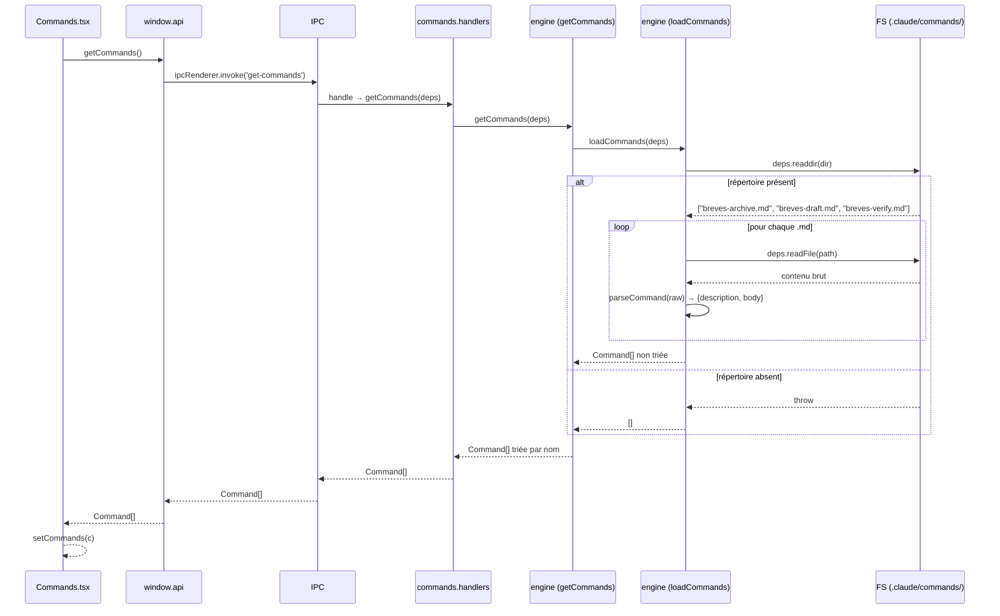
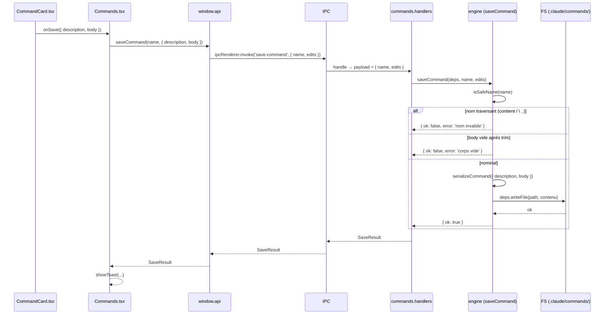

# Architecture — Module : commands

> Module : commands · reverse (constat) · cartographié à `4ce7095`
> Rédigé en posture Architecte Module (reverse) : chaque assertion est tracée. Le code fait foi.
> Réfère le socle global : `docs/project/architecture.md` pour la stack, les couches et le contrat IPC.

---

## Périmètre du module

| Artefact | Rôle | Trace |
|---|---|---|
| `src/renderer/pages/Commands.tsx` | Vue React de liste et d'édition des commandes | `Commands.tsx:1-41` |
| `src/renderer/components/CommandCard.tsx` | Composant formulaire par commande (description + corps + bouton) | `CommandCard.tsx:1-33` |
| `src/renderer/components/CommandCard.module.css` | Styles locaux du composant | `CommandCard.module.css:1-5` |
| `src/renderer/components/CommandCard.stories.tsx` | Story Storybook (vitrine design system) | `CommandCard.stories.tsx:1-19` |
| `src/main/ipc/commands.handlers.ts` | Enregistrement des handlers IPC `get-commands` et `save-command` | `commands.handlers.ts:1-10` |
| `src/main/engine.ts` — `loadCommands` | Scan du dossier `.claude/commands/`, parse chaque `.md` | `engine.ts:222-236` |
| `src/main/engine.ts` — `getCommands` | Appelle `loadCommands` et trie par nom | `engine.ts:238-240` |
| `src/main/engine.ts` — `saveCommand` | Validation + sérialisation + écriture FS | `engine.ts:242-254` |
| `src/main/engine.ts` — `isSafeName` | Garde anti path-traversal partagée avec `saveAgent` | `engine.ts:194-196` |
| `src/domain/commands.ts` | Types `Command`, `CommandEdits` + `parseCommand`, `serializeCommand` | `commands.ts:1-21` |
| `src/domain/frontmatter.ts` | Parser YAML frontmatter trivial (partagé avec `agents.ts`) | `frontmatter.ts:1-11` |
| `.claude/commands/breves-verify.md` | Slash-command Phase 1 | données externes |
| `.claude/commands/breves-draft.md` | Slash-command Phase 2 | données externes |
| `.claude/commands/breves-archive.md` | Slash-command Phase 3 | données externes |

**Hors périmètre de ce module :**
- `src/main/ipc/command.handlers.ts` (sans « s ») — exécution du pipeline (`send-command`, `archive-ingest`), module **nouvelle-edition**.
- Lecture et exécution des commandes par le SDK Claude — module **nouvelle-edition** / socle.

---

## Modèle de données (types TS, constatés)

```typescript
// src/domain/commands.ts:3-12
export interface Command {
  name: string;         // nom du fichier sans extension (ex. : "breves-verify")
  description: string;  // champ frontmatter YAML "description:"
  body: string;         // corps Markdown après le frontmatter (trim appliqué)
}

export interface CommandEdits {
  description: string;  // nouvelle valeur description (peut être vide)
  body: string;         // nouveau corps (doit être non vide après trim — engine.ts:244)
}
```

**Format de stockage (fichier `.md`) :**

```
---
description: <valeur ou vide>
---

<corps Markdown>
```

Sérialisé par `serializeCommand` — vu `src/domain/commands.ts:19-21`. La lecture inverse est assurée par `parseCommand` via `splitFrontmatter`.

**Résultat de sauvegarde :**

```typescript
// src/shared/types/api.ts:9
type SaveResult = { ok: boolean; error?: string }
```

---

## Structure du module (par couche)

```
RENDERER
  Commands.tsx             — useEffect → getCommands() au montage ; save(name, edits) au submit
  CommandCard.tsx          — formulaire local (Input description + Textarea body + Button)
  CommandCard.module.css   — styles locaux
  CommandCard.stories.tsx  — story Storybook (vitrine, outil de dev)

PRELOAD (contrat)
  window.api.getCommands()              — src/preload/index.ts:22
  window.api.saveCommand(name, edits)   — src/preload/index.ts:23

IPC (canaux)
  IPC.getCommands  = 'get-commands'   — src/shared/types/ipc.ts:12
  IPC.saveCommand  = 'save-command'   — src/shared/types/ipc.ts:13

MAIN
  commands.handlers.ts:4-9  — registerCommandsHandlers → handle('get-commands') + handle('save-command')
  engine.ts:238-240         — getCommands(deps) : loadCommands → sort lexicographique
  engine.ts:222-236         — loadCommands(deps) : readdir + filter .md + parseCommand
  engine.ts:242-254         — saveCommand(deps, name, edits) : isSafeName + body.trim + writeFile
  engine.ts:194-196         — isSafeName(name) : rejette /  \ ..

DOMAIN (logique pure)
  commands.ts:14-17  — parseCommand(raw) : splitFrontmatter → { description, body }
  commands.ts:19-21  — serializeCommand(edits) : frontmatter + body.trim()
  frontmatter.ts:1-11 — splitFrontmatter(raw) : parser YAML trivial (partagé avec agents.ts)

DONNÉES EXTERNES
  {repoDir}/.claude/commands/breves-verify.md
  {repoDir}/.claude/commands/breves-draft.md
  {repoDir}/.claude/commands/breves-archive.md
```

---

## Note de frontière : `command.handlers.ts` vs `commands.handlers.ts`

Deux fichiers au nom quasi-identique dans `src/main/ipc/` :

| Fichier | Rôle | Canaux IPC |
|---|---|---|
| `command.handlers.ts` (sans « s ») | Exécution du pipeline (dispatch skill → SDK, stream events, archivage) | `send-command`, `archive-ingest`, push `command-event` |
| `commands.handlers.ts` (avec « s ») | CRUD des fichiers de commandes (.md) — **ce module** | `get-commands`, `save-command` |

La confusion est un risque de maintenance documenté. Le nom `save-command` (IPC canal, sans « s ») est différent du nom `commands.handlers.ts` (fichier, avec « s ») — nommage asymétrique constaté.

---

## Diagramme de séquence — chargement de la vue



---

## Diagramme de séquence — sauvegarde d'une commande



---

## Gestion d'état (slice Zustand — absent pour ce module)

Le module **commands** n'a **pas de slice dédié dans `app.store.ts`**. L'état des commandes chargées est porté par un `useState` local dans `Commands.tsx` (`commands: Command[] | null`) — vu `Commands.tsx:9`. Les éditions en cours sont portées par des `useState` locaux dans `CommandCard.tsx` (`description`, `body`) — vu `CommandCard.tsx:12-13`.

Ce choix est cohérent avec la faible fréquence d'accès à la vue Commandes (pas de partage inter-vues nécessaire).

---

## Contrat IPC du module

| Canal | Direction | Payload envoyé | Payload reçu | Handler (trace) |
|---|---|---|---|---|
| `get-commands` | renderer → main | `{}` (aucun argument) | `Command[]` | `commands.handlers.ts:5` |
| `save-command` | renderer → main | `{ name: string, edits: CommandEdits }` | `SaveResult` | `commands.handlers.ts:6` |

**Côté preload (trace) :**
```typescript
// src/preload/index.ts:22-23
getCommands: () => ipcRenderer.invoke(IPC.getCommands),
saveCommand: (name, edits) => ipcRenderer.invoke(IPC.saveCommand, { name, edits }),
```

**Côté type API (trace) :**
```typescript
// src/shared/types/api.ts:28-29
getCommands(): Promise<Command[]>;
saveCommand(name: string, edits: CommandEdits): Promise<SaveResult>;
```

---

## Contraintes et dépendances constatées

| Contrainte | Trace | Note |
|---|---|---|
| Dépend de `repoDir` valide | `engine.ts:223` | Si invalide ou `.claude/commands/` absent → `[]` (silencieux, GAP-17) |
| `isSafeName` partagée avec `saveAgent` | `engine.ts:194-196` | Même règle anti path-traversal pour agents et commands |
| État local `CommandCard` non réinitialisé | `CommandCard.tsx:12-13` | Si la liste est rechargée, les valeurs initiales du `useState` ne changent pas (GAP-CMD-01) |
| Aucune validation UI avant envoi IPC | `CommandCard.tsx:30` | La garde corps vide est uniquement côté backend (GAP-CMD-02) |
| Nommage asymétrique `command` vs `commands` | `ipc/command.handlers.ts` vs `ipc/commands.handlers.ts` | Risque de confusion maintenance — documenté ci-dessus |

---

## GAPS À REMONTER (module commands — architecture)

| # | Observation | Source |
|---|---|---|
| GAP-16 | `Commands.tsx` et `CommandCard.tsx` non testés : pas de setup de test renderer (env node, jsdom absent) | `REVERSE_GAPS.md`, `vitest.config.mjs` |
| GAP-CMD-01 | État local `CommandCard` (`useState`) non réinitialisé si le parent recharge la liste après sauvegarde : drift potentiel entre affichage et fichier | `CommandCard.tsx:12-13` |
| GAP-CMD-02 | Absence de validation corps non vide côté UI — la garde est uniquement dans `saveCommand` backend | `CommandCard.tsx:30`, `engine.ts:244` |
| GAP-CMD-03 | Nommage `command.handlers.ts` / `commands.handlers.ts` quasi-identique crée un risque de confusion dans les imports et la maintenance | `src/main/ipc/` |
