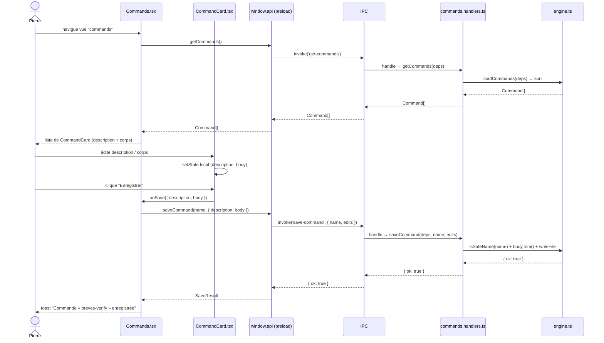

# Specs — Module : commands

> Module : commands · reverse (constat) · cartographié à `4ce7095`
> Rédigé en posture PO Module (reverse) : chaque assertion est tracée. Le code fait foi. Aucune conjecture.

---

## Contexte module

Le module **commands** est la vue de configuration qui permet à Pierre de visualiser et d'éditer le contenu des trois slash-commands du pipeline IA (`breves-verify`, `breves-draft`, `breves-archive`). Ces commandes sont les fichiers `.md` qui pilotent le comportement des agents Claude lors de l'exécution des phases de production de brèves. Sans ces commandes, le pipeline ne peut pas tourner.

**Opérateur unique :** Pierre (persona global, voir `docs/project/specs.md`). Aucun multi-utilisateur, aucune authentification.

**Données pilotées :** fichiers `.claude/commands/*.md` dans `repoDir` (résolu par `src/main/io/env.ts:20-24`). Les trois commandes constatées à `4ce7095` sont `breves-verify.md`, `breves-draft.md`, `breves-archive.md`.

**Distinction critique :** ce module (`commands.handlers.ts`, `Commands.tsx`) gère l'**édition des commandes**. Il ne faut pas le confondre avec `command.handlers.ts` (sans « s »), qui gère l'**exécution du pipeline** (canaux `send-command` et `archive-ingest`), relevant du module **nouvelle-edition**.

---

## User stories (constatées)

### US-CMD-01 — Lister les slash-commands disponibles

**En tant que** Pierre,
**je veux** voir la liste de toutes les commandes présentes dans `.claude/commands/`,
**afin de** savoir quelles commandes existent et accéder à leur contenu.

**Critères d'acceptation (constatés) :**
- La vue Commandes liste toutes les commandes trouvées dans `.claude/commands/*.md`, triées par nom (ordre lexicographique) — vu `src/renderer/pages/Commands.tsx:13-16`, `src/main/engine.ts:238-239`.
- Chaque commande est rendue par un composant `CommandCard` affichant le nom en préfixe `/` (`/breves-verify`), une zone description et une zone corps — vu `src/renderer/components/CommandCard.tsx:22`.
- Si le répertoire `.claude/commands/` est absent ou vide, le message `Aucune commande dans .claude/commands/.` s'affiche — vu `Commands.tsx:33`.
- Pendant le chargement, le message `Chargement…` est affiché (`commands === null`) — vu `Commands.tsx:31`.

**Cas d'erreur :**
- `repoDir` invalide ou `.claude/commands/` absent → `loadCommands` retourne `[]` → liste vide, message `Aucune commande` — vu `src/main/engine.ts:224-228`.

---

### US-CMD-02 — Éditer la description d'une commande

**En tant que** Pierre,
**je veux** modifier la description courte d'une commande (champ `description` du frontmatter YAML),
**afin de** maintenir les métadonnées à jour sans éditer les fichiers `.md` manuellement.

**Critères d'acceptation (constatés) :**
- Le champ `description` est affiché dans un `Input` éditable (état local React, initialisé à `command.description`) — vu `CommandCard.tsx:12,26-27`.
- La description peut être vide : `serializeCommand` produit un frontmatter valide avec `description: ` — vu `src/domain/commands.ts:20`.
- Le champ n'est pas limité en longueur côté UI (aucune validation constatée).

**Cas d'erreur :** aucun côté description (une description vide est valide).

---

### US-CMD-03 — Éditer le corps (prompt) d'une commande

**En tant que** Pierre,
**je veux** modifier le corps complet d'une commande (le prompt Markdown après le frontmatter),
**afin d'** ajuster les instructions données aux agents Claude sans quitter l'app.

**Critères d'acceptation (constatés) :**
- Le corps est affiché dans un `Textarea` éditable (état local React, initialisé à `command.body`, `spellCheck={false}`) — vu `CommandCard.tsx:13,28-29`.
- Le textarea a une hauteur minimale de 220 px, police monospace 12 px — vu `CommandCard.module.css:4`.
- Un corps vide (ou ne contenant que des espaces) est **refusé** par le backend : `saveCommand` retourne `{ ok: false, error: 'corps vide' }` — vu `src/main/engine.ts:244`.

**Cas d'erreur :**
- Corps vide → toast `Échec : corps vide` — vu `Commands.tsx:23`.

---

### US-CMD-04 — Enregistrer les modifications d'une commande

**En tant que** Pierre,
**je veux** cliquer « Enregistrer » pour persister les modifications d'une commande dans son fichier `.md`,
**afin de** voir les changements pris en compte lors du prochain run du pipeline.

**Critères d'acceptation (constatés) :**
- Le bouton `Enregistrer` (`variant="primary"`) est présent dans chaque `CommandCard` — vu `CommandCard.tsx:30`.
- Cliquer déclenche `onSave({ description, body })` → `window.api.saveCommand(name, edits)` → IPC `save-command` — vu `Commands.tsx:21-24`, `CommandCard.tsx:30`.
- Un toast `Commande « ${name} » enregistrée` confirme la sauvegarde réussie — vu `Commands.tsx:23`.
- Un toast `Échec : ${r.error ?? 'inconnu'}` signale l'échec — vu `Commands.tsx:23`.
- Le fichier `.claude/commands/${name}.md` est réécrit intégralement par `serializeCommand` : frontmatter `---\ndescription: …\n---\n\n${body}\n` — vu `src/domain/commands.ts:19-21`.

**Règles métier (constatées) :**
- **Anti path-traversal** : un nom contenant `/`, `\` ou `..` est rejeté par `isSafeName` — vu `src/main/engine.ts:194-195` (corrigé commit `4ce7095`). Le nom provient du fichier `.md` déjà chargé, non saisi par l'utilisateur dans ce flux (risque limité, mais garde actif).
- **Corps non vide** : `edits.body.trim()` doit être non vide — vu `engine.ts:244`.
- **Description optionnelle** : une description vide est acceptée, produit `description: ` dans le frontmatter — vu `domain/commands.ts:20`.

**Cas d'erreur :**
- Nom traversant → `{ ok: false, error: 'nom invalide' }` — vu `engine.ts:243`.
- Corps vide → `{ ok: false, error: 'corps vide' }` — vu `engine.ts:244-246`.
- `deps.writeFile` lève (ex. : permissions FS) → `{ ok: false, error: e.message }` — vu `engine.ts:251-253`.

---

## Parcours nominal (Mermaid)

---

## États de l'interface (constatés)

| État | Condition | Ce qui s'affiche |
|---|---|---|
| Chargement | `commands === null` (état initial avant résolution IPC) | `Chargement…` (Text tone="faint") — `Commands.tsx:31` |
| Nominal | `commands.length > 0` | Liste de `CommandCard` (une par commande) |
| Vide | `commands.length === 0` | `Aucune commande dans .claude/commands/.` — `Commands.tsx:33` |
| Sauvegarde réussie | `r.ok === true` | Toast `Commande « X » enregistrée` |
| Sauvegarde échouée | `r.ok === false` | Toast `Échec : <r.error>` |

---

## GAPS À REMONTER (module commands — specs)

| # | Observation | Source |
|---|---|---|
| GAP-16 | `Commands.tsx` et `CommandCard.tsx` non testés directement (pages React, pas de setup de test renderer dans la suite) | `REVERSE_GAPS.md`, `vitest.config.mjs` |
| GAP-CMD-01 | L'état local de `CommandCard` (description + body) n'est pas réinitialisé si la liste `commands` est rechargée depuis le parent après une sauvegarde : le composant garde ses valeurs initiales tant qu'il n'est pas remonté | `CommandCard.tsx:12-13` — constaté, non corrigé |
| GAP-CMD-02 | Aucune validation côté UI de la longueur ou du format du corps avant l'envoi IPC (la garde est uniquement côté backend) | `CommandCard.tsx:30`, `engine.ts:244` |
