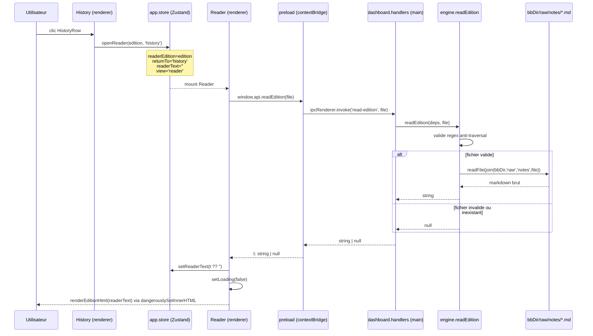

# Architecture — module historique

> Module : historique · reverse (constat) · cartographié à `4ce7095`
> Framework : **reverse (constat)**. Chaque assertion est tracée (`fichier:ligne`). Le code fait foi.
> Réfère le socle : `docs/project/architecture.md` pour le diagramme global, la stack et les couches.

---

## Périmètre architectural du module

Le module historique traverse **trois couches** sans en posséder aucune en propre :

| Couche | Artefacts propres au module | Artefacts partagés (réf. socle) |
|---|---|---|
| Renderer | `pages/History.tsx`, `pages/Reader.tsx`, `components/HistoryRow.tsx`, `components/EditionRow.tsx` | `store/app.store.ts` (slices `readerText/readerEdition/returnTo`), `layouts/Shell.tsx` (back), primitives `Card`, `Text`, `Button` |
| Main | — | `ipc/dashboard.handlers.ts` (canal `read-edition`, partagé avec accueil), `engine.readEdition` |
| Domain / IO | `io/editions.io.ts` (`listEditions`), `domain/edition.ts` (`renderEditionHtml`, `extractBreves`) | `domain/format.ts` (`escapeHtml`, `inlineMd`, `dateLong`) |

---

## Modèle de données

### `EditionSummary` (constaté)

Vu `src/main/io/editions.io.ts:6-13` :

```typescript
interface EditionSummary {
  file: string;   // nom de fichier brut, ex. "2026-06-17-breves-ia-merim.md"
  date: string;   // "YYYY-MM-DD", issu du groupe 1 de EDITION_RE
  range: string;  // = date (redondant, valeur identique :37)
  count: number;  // nombre de brèves (blocs sentinelle "— … —" comptés par regex :36)
  corr: number;   // toujours 0 (non calculé — GAP-06)
  title: string;  // slug humanisé (groupe 2 optionnel de EDITION_RE, sinon "")
}
```

### `Breve` (constaté)

Vu `src/domain/edition.ts:114-119` — utilisé uniquement dans `extractBreves`, non consommé par les pages History/Reader directement (consommé dans le flux soul — module soul) :

```typescript
interface Breve {
  date: string;
  source: string;    // hostname extrait de l'URL
  accroche: string;  // premier **gras** ou première ligne
  texte: string;     // corps complet (markdown brut)
}
```

### Convention de nommage des fichiers

Regex de validation (deux occurrences, réf. GAP-07) :

| Localisation | Regex | Rôle |
|---|---|---|
| `src/main/io/editions.io.ts:4` | `^(\d{4}-\d{2}-\d{2})-breves-ia-merim(?:-([a-z0-9-]+))?\.md$` | Scan IO : filtre les fichiers à lister |
| `src/main/engine.ts:122` | `^\d{4}-\d{2}-\d{2}-breves-ia-merim(-[a-z0-9-]+)?\.md$` | Handler `read-edition` : validation anti-traversal |

Les deux regex sont équivalentes fonctionnellement mais **dupliquées** — risque de drift (réf. GAP-07, type `divergence`).

Exemples valides :
- `2026-06-17-breves-ia-merim.md` (sans slug)
- `2026-06-25-breves-ia-merim-ai-act-omnibus.md` (avec slug)

---

## Structure de composants

```
History (page)
  └── HistoryRow × N   (composant, wrappé dans ui/Card)
        → dateLong(edition.date)
        → edition.title (optionnel)
        → edition.count, edition.corr

Reader (page, hors FLOW/VIEWS)
  ├── ui/Text (en-tête : date · titre · count · "archivée")
  ├── ui/Button "Copier"
  └── <div dangerouslySetInnerHTML={{ __html: renderEditionHtml(readerText) }} />
```

`EditionRow` est un composant alternatif (simplifié, sans `Card`) utilisé dans le module soul (`EchEditions.tsx`) pour le choix d'échantillons — **hors périmètre** du module historique.

---

## Séquence IPC — ouverture d'une édition



---

## Gestion d'état — slices store

Vu `src/renderer/store/app.store.ts` :

| Slice | Type | Valeur initiale | Action principale |
|---|---|---|---|
| `readerEdition` | `EditionSummary \| null` | `null` `:105` | `openReader(edition, from)` `:139` |
| `readerText` | `string` | `''` `:104` | `setReaderText(t)` `:138` |
| `returnTo` | `string \| null` | `null` `:116` | `openReader(edition, from)` `:139`, `setReturnTo(v)` `:157` |

`openReader` est **atomique** : elle fixe les trois slices + `view='reader'` en un seul `set` `:139`. Le `returnTo` est lu par `Shell.tsx:27` pour le retour contextuel.

---

## Rendu HTML — `renderEditionHtml` (domain)

Vu `src/domain/edition.ts:25-110`. Parseur ligne-à-ligne, sans bibliothèque markdown externe. Produit des classes CSS préfixées `ed-*` :

| Pattern détecté | Sortie HTML | Classe CSS |
|---|---|---|
| Première ligne non-date (sans `#`) | Titre d'édition | `ed-title` |
| Ligne `# Titre` avant la 1re date | Titre (préfixe `#` retiré) | `ed-title` |
| Lignes intro avant la 1re date | Paragraphe intro | `ed-intro` |
| `— … —` | Ouverture `div.card.ed-breve` + `div.ed-date` | `card ed-breve`, `ed-date` |
| `https?://…` (URL nue ou préfixée `Source :`) | Lien `<a class="ed-src" data-url="…">domaine →</a>` | `ed-src` |
| `## titre` ou `### titre` | Sous-titre | `ed-h2` |
| `---` (3+ tirets) | Séparateur | `ed-hr` |
| Tableau Markdown (détecté par `|` + ligne `---`) | Liste de sources | `ed-srclist` + `ed-srcrow` |
| `**accroche**` (ligne corps) | Séparateur `ed-bsep` + `<p class="ed-body">` | `ed-bsep`, `ed-body` |
| Corps normal | `<p class="ed-body">` | `ed-body` |

**Échappement :** `escapeHtml` (via `inlineMd`) échappe `& < >` mais **pas `"` ni `'`** — réf. GAP-14 (sécurité, sévérité basse, contenu semi-fiable local).

**Injection via `dangerouslySetInnerHTML` :** le HTML produit est injecté directement dans le DOM du Reader (`Reader.tsx:53`). Les styles `ed-*` sont définis dans `src/renderer/styles/app.css` (non vérifié dans ce scope).

---

## Dépendances du module

```
History.tsx
  ← store.dashboard.editions  (peuplé par get-dashboard — module accueil)
  ← HistoryRow.tsx
      ← domain/format.dateLong
      ← ui/Card

Reader.tsx
  ← store.readerEdition, store.readerText, store.openReader
  ← window.api.readEdition  (preload → IPC 'read-edition')
  ← domain/edition.renderEditionHtml
  ← domain/format.dateLong
  ← ui/Text, ui/Button

editions.io.listEditions  (appelé par engine.getDashboard, consommé par accueil)
engine.readEdition         (handler 'read-edition')
```

**Dépendance de données externe :** `bbDir/raw/notes/` — résolu par config (`src/main/io/env.ts:20-24`). Si `bbDir` n'est pas configuré, les données sont absentes (réf. GAP-17).

---

## GAPS À REMONTER (scope architecture)

- **GAP-M3 (frontière handler)** — `dashboard.handlers.ts` regroupe `get-dashboard` (accueil) et `read-edition` (historique). Un fichier à deux modules, frontière conceptuelle non matérialisée en code.
- **GAP-06 (corr:0)** — `EditionSummary.corr` jamais calculé (`editions.io.ts:37`), affiché dans `HistoryRow.tsx:26`.
- **GAP-07 (duplication regex)** — Regex de validation du nom d'édition dupliquée en deux endroits (`editions.io.ts:4` vs `engine.ts:122`).
- **GAP-14 (escapeHtml partiel)** — `escapeHtml` n'échappe pas `"` ni `'` ; risque d'injection attribut si URL contient `"` dans `srcLink`.
- **GAP-04 (hors-FLOW)** — `reader` absent de `VIEWS` et de `nextView` ; atteint uniquement par `openReader`.
