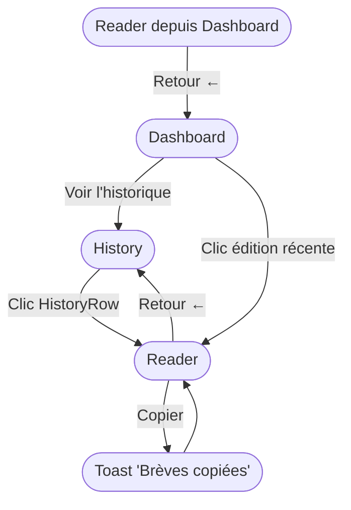

# Specs — module historique

> Module : historique · reverse (constat) · cartographié à `4ce7095`
> Framework : **reverse (constat)**. Chaque assertion est tracée (`fichier:ligne`). Le code fait foi.
> Réfère le socle : `docs/project/specs.md` pour le contexte produit, la persona et la navigation globale.

---

## Périmètre fonctionnel constaté

Le module **historique** couvre deux écrans distincts qui collaborent :

- **History** (`src/renderer/pages/History.tsx`) — liste des éditions archivées, chaque entrée ouvrant le lecteur.
- **Reader** (`src/renderer/pages/Reader.tsx`) — lecteur d'une édition, rendu HTML, bouton Copier, retour contextuel.

Les données proviennent du scan de `{bbDir}/raw/notes/*.md` (`src/main/io/editions.io.ts:21-40`). Le module ne produit aucune écriture ; il est **entièrement en lecture** (un seul canal IPC actif en propre : `read-edition`).

---

## User Stories

### US-H1 — Parcourir l'historique des éditions

**En tant que** Pierre,
**je veux** voir la liste de toutes les éditions archivées,
**afin de** retrouver une édition passée par date et titre.

**Critères d'acceptance (constatés) :**

| # | Critère | Trace |
|---|---|---|
| H1-a | La liste s'affiche sur la vue `history` (accessible depuis le header) | `src/renderer/pages/History.tsx:5-25`, `src/renderer/layouts/Shell.tsx:52-67` |
| H1-b | Chaque édition est rendue par `HistoryRow` : date longue FR, titre optionnel, compte de brèves, compte de corrections, label « Lire › » | `src/renderer/components/HistoryRow.tsx:10-32` |
| H1-c | Les éditions sont triées plus récentes d'abord | `src/main/io/editions.io.ts:39` |
| H1-d | Si aucune édition n'existe, un message « Aucune édition archivée. » est affiché | `src/renderer/pages/History.tsx:18` |
| H1-e | La liste est lue depuis `store.dashboard.editions` (chargé par `get-dashboard` à l'accueil) | `src/renderer/pages/History.tsx:6` |

**Règle métier RM-H1 :** seuls les fichiers dont le nom correspond à la regex `^(\d{4}-\d{2}-\d{2})-breves-ia-merim(?:-([a-z0-9-]+))?\.md$` sont affichés (`src/main/io/editions.io.ts:4`). Tout autre fichier dans `raw/notes/` est ignoré silencieusement.

**Règle métier RM-H2 :** si le répertoire `{bbDir}/raw/notes` est absent ou illisible, `listEditions` renvoie `[]` sans lever d'erreur (`src/main/io/editions.io.ts:24-28`). La liste s'affiche alors vide (état H1-d).

---

### US-H2 — Ouvrir une édition dans le lecteur

**En tant que** Pierre,
**je veux** cliquer sur une édition dans la liste pour lire son contenu rendu,
**afin de** consulter les brèves telles qu'elles ont été archivées.

**Critères d'acceptance (constatés) :**

| # | Critère | Trace |
|---|---|---|
| H2-a | Un clic sur `HistoryRow` appelle `openReader(edition, 'history')` et navigue sur `reader` | `src/renderer/pages/History.tsx:19`, `src/renderer/store/app.store.ts:139` |
| H2-b | Le store mémorise `readerEdition`, `returnTo = 'history'`, vide `readerText`, fixe `view = 'reader'` | `src/renderer/store/app.store.ts:139` |
| H2-c | Le lecteur charge le texte brut via `window.api.readEdition(file)` (canal `read-edition`) au montage | `src/renderer/pages/Reader.tsx:21-29` |
| H2-d | Si `readerEdition` est null au montage du Reader, la vue bascule vers `history` | `src/renderer/pages/Reader.tsx:18-19` |
| H2-e | Pendant le chargement, « Chargement… » est affiché | `src/renderer/pages/Reader.tsx:50-51` |
| H2-f | Si le texte est vide (édition introuvable), un message « Texte introuvable dans le wiki (raw/notes/{file}). » est affiché | `src/renderer/pages/Reader.tsx:54-55` |
| H2-g | Le texte est rendu en HTML par `renderEditionHtml(readerText)` injecté via `dangerouslySetInnerHTML` | `src/renderer/pages/Reader.tsx:53` |
| H2-h | L'en-tête du lecteur affiche : date longue FR · titre (si présent) · nb de brèves · « archivée » | `src/renderer/pages/Reader.tsx:34` |

**Règle métier RM-H3 (anti-traversal) :** le backend rejette tout `file` dont le nom ne correspond pas à `^\d{4}-\d{2}-\d{2}-breves-ia-merim(-[a-z0-9-]+)?\.md$` — renvoie `null` sans lever d'erreur (`src/main/engine.ts:122`). Le renderer affiche alors l'état « texte introuvable ».

**Cas d'erreur CE-H1 :** nom de fichier invalide (traversal, extension différente, chemin absolu) → `readEdition` retourne `null` → le Reader affiche le message d'état vide (H2-f).

---

### US-H3 — Copier le texte de l'édition

**En tant que** Pierre,
**je veux** copier le texte brut de l'édition en un clic,
**afin de** le coller dans Teams ou tout autre outil.

**Critères d'acceptance (constatés) :**

| # | Critère | Trace |
|---|---|---|
| H3-a | Le bouton « Copier » est présent dans l'en-tête du lecteur | `src/renderer/pages/Reader.tsx:46-48` |
| H3-b | Un clic appelle `window.api.copy(readerText)` (canal `copy`) | `src/renderer/pages/Reader.tsx:37` |
| H3-c | Un toast « Brèves copiées » est affiché après la copie | `src/renderer/pages/Reader.tsx:38`, `src/renderer/store/app.store.ts:122` |

**Note :** le texte copié est `readerText` (markdown brut), non le HTML rendu.

---

### US-H4 — Revenir à la vue d'origine depuis le lecteur

**En tant que** Pierre,
**je veux** appuyer sur le bouton Retour du lecteur pour revenir à la vue depuis laquelle j'ai ouvert l'édition,
**afin de** reprendre mon contexte sans aller sur l'accueil systématiquement.

**Critères d'acceptance (constatés) :**

| # | Critère | Trace |
|---|---|---|
| H4-a | Le Shell gère le retour : si `view === 'reader'`, `setView(returnTo ?? 'dashboard')` | `src/renderer/layouts/Shell.tsx:26-27` |
| H4-b | Depuis History, `returnTo = 'history'` → retour sur History | `src/renderer/pages/History.tsx:19` |
| H4-c | Depuis Dashboard, `returnTo = 'dashboard'` → retour sur Dashboard | `src/renderer/pages/Dashboard.tsx:24` |
| H4-d | Si `returnTo` est null (cas théorique), retour sur Dashboard par défaut | `src/renderer/layouts/Shell.tsx:27` |

---

## Parcours utilisateur (Mermaid)



---

## États UI constatés

### Liste History — état vide

```
┌────────────────────────────────┐
│  Chaque édition validée est    │
│  archivée et intégrée au wiki  │
│  personnel (llm-wiki).         │
│                                │
│  Aucune édition archivée.      │
└────────────────────────────────┘
```

> Condition : `store.dashboard.editions` = `[]` (`History.tsx:18`).

### Lecteur — état chargement

```
┌────────────────────────────────┐
│ 13 juin 2026 · GLM · 3 brèves  │
│ · archivée          [Copier]   │
│                                │
│ Chargement…                    │
└────────────────────────────────┘
```

> Condition : `loading = true` (`Reader.tsx:50-51`).

### Lecteur — état texte introuvable

```
┌────────────────────────────────┐
│ 13 juin 2026 · GLM · 3 brèves  │
│ · archivée          [Copier]   │
│                                │
│ Texte introuvable dans le wiki │
│ (raw/notes/…md).               │
└────────────────────────────────┘
```

> Condition : `readEdition` retourne `null` ou chaîne vide (`Reader.tsx:54-55`).

---

## Cas d'erreur et limites

| Cas | Comportement constaté | Trace |
|---|---|---|
| `bbDir/raw/notes` absent ou illisible | `listEditions` retourne `[]`, liste vide sans crash | `editions.io.ts:23-28` |
| Fichier non conforme à la regex EDITION_RE | Filtré silencieusement à l'IO | `editions.io.ts:31` |
| Nom traversant envoyé à `read-edition` | `readEdition` retourne `null` | `engine.ts:122` |
| `readerEdition` null au montage de Reader | Redirect vers `history` | `Reader.tsx:18-19` |
| `readEdition` retourne `null` (fichier disparu) | Affichage état vide, pas de crash | `Reader.tsx:54-55` |

---

## GAPS À REMONTER (scope specs)

- **GAP-M1 (corr:0)** — `EditionSummary.corr` est toujours `0` (`editions.io.ts:37`) mais s'affiche dans `HistoryRow` (`HistoryRow.tsx:26`). La feature « nombre de corrections » n'est pas implémentée. Réf. GAP-06.
- **GAP-M2 (Reader hors-FLOW)** — `reader` est hors du tableau `VIEWS` et du `FLOW` de `navigation.ts` (réf. GAP-04) : la vue est atteinte uniquement par `openReader` (action directe), pas par `nextView`. Non bloquant.
- **GAP-M3 (frontière dashboard.handlers)** — `dashboard.handlers.ts` gère deux canaux de deux modules différents (`get-dashboard` → accueil ; `read-edition` → historique). Le fichier est partagé, la frontière est conceptuelle uniquement. Réf. `_REVERSE_MODULE_MAP.md` note de frontière.
- **GAP-M4 (rechargement)** — Le texte de l'édition est rechargé à chaque changement de `readerEdition` (effet `Reader.tsx:15,30`). Si le fichier change entre deux ouvertures, le nouveau contenu est affiché sans invalidation du cache de `dashboard.editions`.
