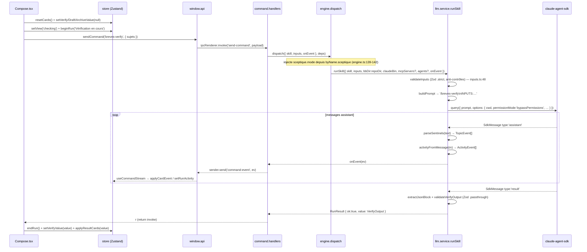
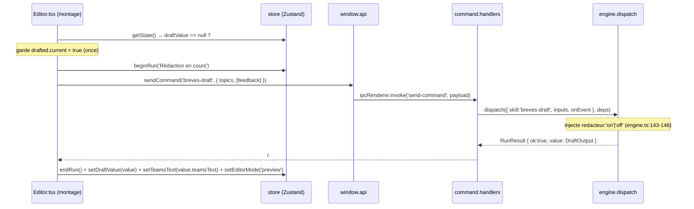
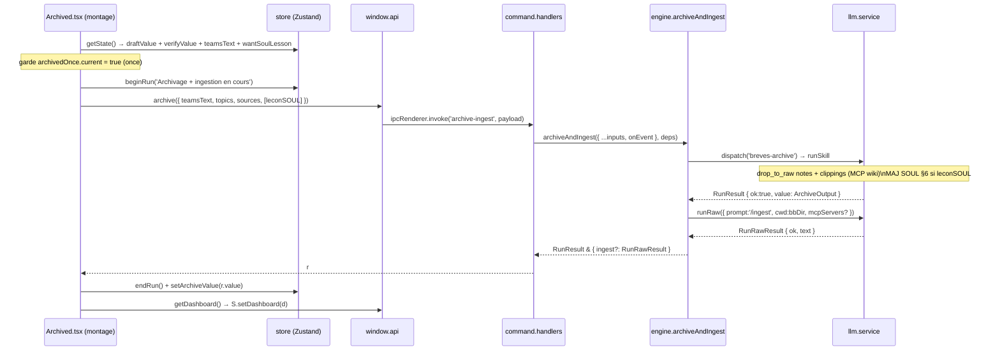

> Module : nouvelle-edition · reverse (constat) · cartographié à 4ce7095

# Architecture — Module nouvelle-edition

Rôle : **Architecte Module** · Cycle 1 · mode reverse (constat).

L'architecture globale (couches, patterns, IPC centralisé, packaging) est documentée dans
`docs/project/architecture.md`. Ce fichier couvre **uniquement les artefacts propres au module**.

---

## 1. Modèle de données (types TS — aucune BDD)

### 1.1 Domaine de vérification — `src/domain/checking.ts`

| Type | Champs | Trace |
|---|---|---|
| `STEPS` | `['recherche','faits','date','source','article']` (tuple `as const`) | `checking.ts:3` |
| `StepState` | `'todo' \| 'active' \| 'done'` | `checking.ts:5` |
| `CheckStep` | `{ name: string; state: StepState }` | `checking.ts:7-10` |
| `Card` | `{ key, title, status, done, error\|null, source\|null, alerte\|null, steps: CheckStep[] }` | `checking.ts:12-21` |
| `VerifyTopicLike` | `{ key, sujet?, source?, alerte? }` — interface de réduction minimale | `checking.ts:23-28` |
| `CheckSummary` | `{ verifies, corriges, nuances }` | `checking.ts:30-34` |

L'état `Card` est **volatil** : reconstruit par réduction d'événements, jamais persisté sur disque.

Fonctions pures exportées :
- `initCard(key, title)` → `Card` (étape 0 active, reste todo) — `checking.ts:36`
- `applyEvent(cards, TopicEvent)` → `Card[]` (machine à états) — `checking.ts:63`
- `applyResult(cards, {topics?})` → `Card[]` (filet zéro-sentinelle) — `checking.ts:96`
- `summary(cards)` → `CheckSummary` — `checking.ts:114`

### 1.2 Domaine d'édition — `src/domain/edition.ts`

| Export | Signature | Rôle | Trace |
|---|---|---|---|
| `Breve` | `{ date, source, accroche, texte }` | Brève parsée depuis une édition archivée | `edition.ts:114` |
| `renderEditionHtml(text)` | `string → string` | Rendu HTML du `teamsText` (escape + markdown inline) | `edition.ts:25` |
| `extractBreves(text)` | `string → Breve[]` | Extraction des brèves depuis un texte édition | `edition.ts:144` |
| `extractJsonBlock(text)` | `string → unknown` | Extraction du dernier bloc JSON fencé (fallback parse entier) | `edition.ts:196` |
| `parseSentinels(text)` | `string → TopicEvent[]` | Parse les lignes `«BREVES» …` en événements typés | `edition.ts:218` |
| `SENTINEL_STEPS` | `string[]` | Copie de `STEPS` utilisée dans `parseSentinels` | `edition.ts:194` |

> GAP-07 (`SENTINEL_STEPS` duplique `STEPS` de `checking.ts:3`) — risque de drift.

### 1.3 Événements métier — `src/domain/events.ts`

| Type | Définition | Trace |
|---|---|---|
| `AlertLevel` | `'corrigé' \| 'nuance' \| 'date'` | `events.ts:1` |
| `Alerte` | `{ niveau: AlertLevel; texte: string }` | `events.ts:3-6` |
| `TopicEvent` | union : `topic-detected \| topic-progress \| topic-done \| topic-error` | `events.ts:8-12` |
| `ActivityEvent` | `{ type: 'activity'; label: string }` | `events.ts:14-17` |

`TopicEvent` porte le protocole de streaming sentinelles → cards. `ActivityEvent` porte le label d'activité
affiché dans `RunStatus`.

### 1.4 Schémas Zod (contrats de sérialisation) — `src/shared/schemas/`

#### Entrées (`inputs.ts`)

| Schéma | Skill | Champs validés | Trace |
|---|---|---|---|
| `verifySchema` | `breves-verify` | `{ sujets: bulkText, sceptique?: enum }` — `.strict()` | `inputs.ts:27` |
| `draftSchema` | `breves-draft` | `{ topics: unknown[], feedback?: freeString, redacteur?: enum }` — `.strict()` | `inputs.ts:29` |
| `archiveSchema` | `breves-archive` | `{ teamsText: string, topics: unknown[], sources: unknown[], leconSOUL?: freeString }` — `.strict()` | `inputs.ts:31-38` |

- `bulkText` : ≥1, ≤8000 car., non vide, sans contrôles hors `\n` — `inputs.ts:12-22`
- `freeString` : ≤280 car., sans contrôles — `inputs.ts:5-10`
- `validateInputs(skill, inputs)` : gate d'entrée de `runSkill` — `inputs.ts:48`

#### Sorties (`outputs.ts`)

| Schema | Type exporté | Champs clés | Trace |
|---|---|---|---|
| `verifyOutputSchema` | `VerifyOutput` | `{ topics: topicSchema[] }` — `.passthrough()` | `outputs.ts:30-31` |
| `draftOutputSchema` | `DraftOutput` | `{ teamsText, corrections[], sources[], soulLessonProposee? }` — `.passthrough()` | `outputs.ts:33-49` |
| `archiveOutputSchema` | `ArchiveOutput` | `{ archiveSteps[], newsletterText, soulVersion }` — `.passthrough()` | `outputs.ts:52-58` |
| `topicSchema` | — | `{ key, sujet, date_reelle, fiabilite, source, url_citee, url_clippee, slug, clipping_contenu, faits[], alerte? }` — `.passthrough()` | `outputs.ts:14-28` |
| `alerteSchema` | — | `{ niveau: AlertLevel, texte }` | `outputs.ts:6-9` |

`.passthrough()` sur tous les schémas de sortie : les champs hors-contrat (ex. `raw`, champs extra) sont conservés (carry-over). `fiabilite ∈ { confirme, partiel, non_verifie }`.

---

## 2. Structure de composants

### 2.1 Pages (renderer)

| Fichier | Responsabilité module | Trace |
|---|---|---|
| `src/renderer/pages/Compose.tsx` | Saisie sujets, launch vérification, reset état édition | `Compose.tsx:9-89` |
| `src/renderer/pages/Checking.tsx` | Affichage cards live, résumé post-vérification, navigation detail | `Checking.tsx:9-57` |
| `src/renderer/pages/Detail.tsx` | Délègue à `Drawer` le topic sélectionné (`drawerKey`) | `Detail.tsx:4-10` |
| `src/renderer/pages/Editor.tsx` | Rédaction auto au montage, mode preview/edit, CorrectModal, navigation archived | `Editor.tsx:15-133` |
| `src/renderer/pages/Archived.tsx` | Archivage auto au montage, affichage steps, copie presse-papier, refresh dashboard | `Archived.tsx:11-119` |

### 2.2 Composants métier (renderer/components)

| Fichier | Responsabilité | Trace |
|---|---|---|
| `EnqCard.tsx` | Rendu d'une `Card` (steps, statut, alerte, click detail) | `components/EnqCard.tsx` |
| `Drawer.tsx` | Détail d'un topic vérifié (faits, source, alerte) | `components/Drawer.tsx` |
| `RunStatus.tsx` | Affichage état du run (titre, chrono, activité) | `components/RunStatus.tsx` |
| `CorrectionRow.tsx` | Ligne d'une correction du sceptique | `components/CorrectionRow.tsx` |
| `SourceRow.tsx` | Ligne d'une source/clipping (indicateur repli) | `components/SourceRow.tsx` |
| `CorrectModal.tsx` | Modale feedback + option wantSoulLesson | `components/CorrectModal.tsx` |
| `ArchiveStep.tsx` | Ligne d'une étape d'archivage (`{ t, d }`) | `components/ArchiveStep.tsx` |
| `BreveCard.tsx` | Carte brève (utilisé dans EchBreves — module soul) | `components/BreveCard.tsx` |

Primitives UI (socle) référencées par les pages : `Button`, `Card`, `Text`, `Pill`, `Eyebrow`, `Spinner` — documentées dans `docs/project/architecture.md §3.4`.

---

## 3. Gestion d'état (slices store)

Le module utilise les slices suivantes du store Zustand unique (`src/renderer/store/app.store.ts`).
La définition complète du store est dans `docs/project/architecture.md §3.4`.

| Slice | Type | Rôle dans le module | Actions clés (trace) |
|---|---|---|---|
| `cards` | `Card[]` | Cards de vérification live | `setCards`, `resetCards`, `applyCardEvent`, `applyResultCards` — `store:72-74` |
| `verifyValue` | `VerifyOutput \| null` | Sortie Phase 1 | `setVerifyValue` — `store:69` |
| `draftValue` | `DraftOutput \| null` | Sortie Phase 2 | `setDraftValue` — `store:70` |
| `archiveValue` | `ArchiveOutput \| null` | Sortie Phase 3 | `setArchiveValue` — `store:71` |
| `teamsText` | `string` | Texte éditorial (éditable directement) | `setTeamsText` — `store:81` |
| `runStatus` | `RunStatus` | État run actif (titre, chrono, activité) | `beginRun`, `endRun`, `setRunActivity`, `tickClock` — `store:75-78` |
| `editorMode` | `'preview' \| 'edit'` | Bascule aperçu/édition dans Editor | `setEditorMode` — `store:85` |
| `wantSoulLesson` | `boolean` | Gate leçon SOUL (CorrectModal → Archived) | `setWantSoulLesson` — `store:86` |
| `drawerKey` | `string \| null` | Clé du topic sélectionné pour Detail | `setDrawerKey` — `store:87` |
| `returnTo` | `string \| null` | Vue de retour depuis Detail | `setReturnTo` — `store:62` |

Pattern notable : `Editor.tsx` et `Archived.tsx` lisent le store **à chaud** via `useAppStore.getState()` dans leurs fonctions async (`runDraft`, `runArchive`) pour éviter les closures périmées sur des valeurs capturées au montage. Trace : `Editor.tsx:34`, `Archived.tsx:18`.

---

## 4. Hook `useCommandStream`

Fichier : `src/renderer/hooks/useCommandStream.ts`

- `useCommandStream()` — monté une seule fois dans `App.tsx` (`:22`). S'abonne à `window.api.onCommandEvent` et dispatche chaque événement vers `handleStreamEvent`.
- `handleStreamEvent(ev)` — routage pur (testable sans React) : `activity` → `store.setRunActivity` ; `topic-*` → `store.applyCardEvent`. Tout autre type ignoré silencieusement.
  _Trace : `useCommandStream.ts:13-23`, `tests/renderer/useCommandStream.test.mjs`._

**Pattern store `getState()` à chaud** : `handleStreamEvent` appelle `useAppStore.getState()` à chaque événement (pas de sélecteur React) — garantit que la réduction s'applique à l'état courant, pas à l'état du montage.

---

## 5. Diagrammes de séquence techniques

### Phase 1 — Vérification (streaming live)

### Phase 2 — Rédaction (montage automatique)

### Phase 3 — Archivage + ingestion wiki

---

## 6. Contrats IPC du module

Les 3 canaux IPC propres au module sont définis dans `src/shared/types/ipc.ts`. Voir §7 de
`docs/project/architecture.md` pour le contrat complet des 20 canaux.

| Canal | Direction | Payload → Retour | Handler (trace) |
|---|---|---|---|
| `send-command` | invoke | `{ skill: string, inputs: Record<string,unknown> }` → `RunResult` | `command.handlers.ts:5` |
| `command-event` | push (sender.send) | `StreamEvent` (TopicEvent \| ActivityEvent) | `command.handlers.ts:8` |
| `archive-ingest` | invoke | `{ teamsText, topics, sources, leconSOUL? }` → `RunResult & { ingest?: RunRawResult }` | `command.handlers.ts:17` |

`StreamEvent` = `TopicEvent | ActivityEvent` — transporté par `sender.send` (push non-invoke). Reçu côté renderer via `window.api.onCommandEvent` (`preload/index.ts`).

---

## 7. Dépendances externes du module

| Dépendance | Rôle | Résolution | Trace |
|---|---|---|---|
| `.claude/commands/breves-verify.md` | Skill Phase 1 — prompt + fan-out enquêteurs | `{repoDir}/.claude/commands/` via `buildPrompt` | `src/shared/skills.ts:5` |
| `.claude/commands/breves-draft.md` | Skill Phase 2 — rédaction dans la plume SOUL | idem | — |
| `.claude/commands/breves-archive.md` | Skill Phase 3 — archivage + MAJ SOUL §6 | idem | — |
| `.claude/agents/enqueteur.md` | Sous-agent Phase 1 (WebSearch/WebFetch, modèle opus) | `{repoDir}/.claude/agents/` via `loadAgents` | `engine.ts:65-82` |
| `.claude/agents/sceptique.md` | Sous-agent Phase 1 optionnel (WebSearch/WebFetch, modèle sonnet) | idem | — |
| `.claude/agents/redacteur.md` | Sous-agent Phase 2 optionnel (aucun outil, modèle opus) | idem | — |
| `MCP boiling-brain-wiki` | `drop_to_raw` (Phase 3) + `/ingest` (Phase 3) | Process stdio, `buildWikiMcp` (`env.ts:44-50`) | `engine.ts:152-155,273-278` |
| `{bbDir}/raw/notes/` | Destination note archivée | chemin résolu via `deps.bbDir` | `archiveAndIngest` |
| `{bbDir}/raw/clippings/` | Destination clippings | idem | — |

Le module `socle` (`services/llm.service.ts`) pilote le SDK : `runSkill` et `runRaw`. Voir `docs/project/architecture.md §3.3` pour les détails du pont SDK (`bypassPermissions`, résolution hors-asar).

---

## GAPS À REMONTER

| # | Type | Observation | À trancher par |
|---|---|---|---|
| GAP-07 | divergence | `SENTINEL_STEPS` (`edition.ts:194`) duplique `STEPS` (`checking.ts:3`) — risque de drift si l'une change | Lead Dev |
| GAP-04 | divergence | Vues `detail` et `reader` hors du routeur `nextView` (`navigation.ts`) mais câblées dans `App.tsx` — modèle partiel | Lead Dev |
| GAP-02 | sécurité | `permissionMode:'bypassPermissions'` hardcodé dans `llm.service.ts:115-116` — posture assumée non documentée | PM / Security |
| GAP-10 | intention | MCP `boiling-brain-wiki` = dépendance externe non versionnée dans ce dépôt — ingest inopérant sans bbDir configuré et script Python présent | PM / Architecte |
