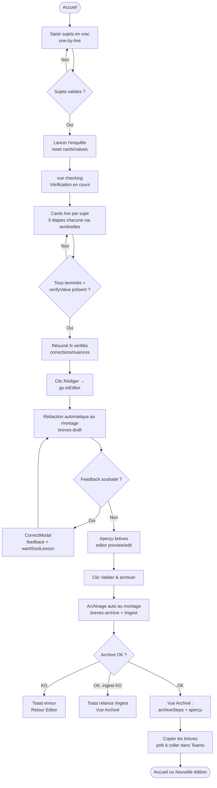

> Module : nouvelle-edition · reverse (constat) · cartographié à 4ce7095

# Spécifications — Module nouvelle-edition

Rôle : **PO Module** · Cycle 1 · mode reverse (constat).

---

## Périmètre

Le module **nouvelle-edition** couvre le **pipeline 3 phases** de production d'une édition de brèves IA :
vérification → rédaction → archivage+ingestion. Il correspond aux vues
`compose → checking → editor → archived` (+ vue `detail` hors-routeur), aux canaux IPC
`send-command`, `command-event` (push) et `archive-ingest`, et aux données externes
`.claude/commands/breves-{verify,draft,archive}.md`, `.claude/agents/{enqueteur,redacteur,sceptique}.md`,
MCP wiki et `bbDir/raw/{notes,clippings}`.

Le socle transverse (store, design system, moteur SDK, preload) est documenté dans `docs/project/specs.md` et `docs/project/architecture.md` ; ce document renvoie aux traces globales sans les redupliquer.

---

## User stories du module

### US-NE-01 : Saisir des sujets en vrac et lancer la vérification (Compose)

**En tant que** Pierre, **je veux** saisir mes sujets d'actualité IA en texte libre (un par ligne) et les envoyer à la vérification automatique, **pour** ne pas avoir à chercher les dates ni les URLs moi-même.

**Critères d'acceptance :**
- Un champ texte multi-lignes accepte les sujets (un par ligne). Limite : ≤ 8 000 caractères, non vide, sans caractères de contrôle hors saut de ligne (`\n`).
  _Trace : `src/shared/schemas/inputs.ts:12-22` (`bulkText`), `tests/shared/inputs.test.mjs:7-20`._
- Un aperçu des sujets détectés (chips, jusqu'à 8 affichés, tronqués à 22 car.) se met à jour en saisie.
  _Trace : `src/renderer/pages/Compose.tsx:22-27`._
- Le bouton « Lancer l'enquête » est désactivé si un run est déjà en cours (`runStatus.active`).
  _Trace : `Compose.tsx:77` (`disabled={runActive}`)._
- Si le champ est vide ou ne contient que des espaces, un toast « Donne au moins un sujet. » s'affiche et la vérification ne démarre pas.
  _Trace : `Compose.tsx:30-34`._
- Au lancement, la vue passe immédiatement à `checking` et le statut de run passe à actif (titre « Vérification en cours »).
  _Trace : `Compose.tsx:39-42`._
- L'état de l'édition précédente (`cards`, `verifyValue`, `draftValue`, `archiveValue`) est réinitialisé avant chaque nouveau lancement.
  _Trace : `Compose.tsx:35-38`._

---

### US-NE-02 : Suivre la vérification en temps réel (Checking)

**En tant que** Pierre, **je veux** voir l'avancement de chaque sujet (5 étapes : recherche, faits, date, source, article) en temps réel pendant que les enquêteurs travaillent, **pour** savoir si la vérification se déroule correctement sans attendre la fin.

**Critères d'acceptance :**
- Une card par sujet détecté s'affiche dès que le sentinel `«BREVES» topic <key>|<sujet>` est émis (avant tout appel d'outil).
  _Trace : `src/domain/checking.ts:36-47` (`initCard`), `src/domain/edition.ts:218` (`parseSentinels`), `src/renderer/hooks/useCommandStream.ts:13-23`._
- Chaque card affiche 5 étapes (`recherche / faits / date / source / article`), progressant de `todo → active → done` au fil des sentinelles `«BREVES» step <key> <étape>`.
  _Trace : `src/domain/checking.ts:3` (STEPS), `:63-94` (`applyEvent`), `tests/domain/checking.test.mjs`._
- Une card passe au statut `done: true`, `status: 'Terminé'` à la réception du sentinel `«BREVES» done <key>`.
  _Trace : `checking.ts:78-84`._
- Une card passe au statut `done: true`, `status: 'Erreur'` à la réception du sentinel `«BREVES» error <key>`.
  _Trace : `checking.ts:85-93`._
- Une card peut afficher une alerte (`niveau: 'corrigé'|'nuance'|'date'`) si le sceptique a rétrogradé la fiabilité.
  _Trace : `src/shared/schemas/outputs.ts:6-9` (`alerteSchema`), `checking.ts:20`._
- Un résumé (N vérifiés · N corrigés · N nuancés) et un bouton « Rédiger les brèves » s'affichent quand tous les enquêteurs ont terminé ET que `verifyValue` est disponible.
  _Trace : `Checking.tsx:18-19,41-55`, `checking.ts:114-124` (`summary`)._
- Pierre peut cliquer sur une card (une fois `verifyValue` disponible) pour ouvrir le détail du sujet (vue `detail`, hors-routeur).
  _Trace : `Checking.tsx:20-26`._

---

### US-NE-03 : Consulter le détail d'un sujet vérifié (Detail)

**En tant que** Pierre, **je veux** consulter les faits vérifiés, la source, l'URL et les éventuelles corrections pour un sujet spécifique, **pour** valider manuellement avant de passer à la rédaction.

**Critères d'acceptance :**
- La vue Detail est accessible depuis Checking (clic sur une card post-`verifyValue`), via `setView('detail')`.
  _Trace : `Checking.tsx:20-26`, `src/renderer/App.tsx:22-37`._
- Un bouton de retour ramène à la vue d'origine (`returnTo`, fixé à `'checking'` lors de l'ouverture).
  _Trace : `Checking.tsx:23`, store `setReturnTo`._
- Les champs affichés incluent : `sujet`, `date_reelle`, `fiabilite`, `source`, `url_citee`, `faits[]`, `alerte` (si présente).
  _Trace : `src/shared/schemas/outputs.ts:14-28` (`topicSchema`), `src/renderer/components/Drawer.tsx`._

---

### US-NE-04 : Lire les brèves rédigées et apporter des corrections (Editor)

**En tant que** Pierre, **je veux** lire la rédaction produite dans ma plume (SOUL), corriger le texte si nécessaire et, le cas échéant, soumettre un feedback pour que l'agent réécrive, **pour** m'assurer que chaque édition correspond bien à mon style avant archivage.

**Critères d'acceptance :**
- La rédaction démarre automatiquement au montage si aucun brouillon n'existe encore (`draftValue == null`). Une seule fois (garde `drafted.current`).
  _Trace : `src/renderer/pages/Editor.tsx:52-59`._
- Le texte est affiché en mode aperçu HTML (`renderEditionHtml`) par défaut, avec bascule vers mode édition directe (`editorMode: 'preview'|'edit'`).
  _Trace : `Editor.tsx:61-84`._
- Les corrections du sceptique (`corrections[]`) sont listées (section « Corrections apportées »).
  _Trace : `Editor.tsx:97-107`, `src/shared/schemas/outputs.ts:35-39`._
- Les sources et clippings (`sources[]`) sont listés, avec indicateur de repli si `url_clippee ≠ url_citee`.
  _Trace : `Editor.tsx:109-116`, `outputs.ts:39-49`._
- Un bouton « Corriger » ouvre `CorrectModal` permettant de saisir un feedback textuel (≤ 280 car., sans caractères de contrôle) et de cocher « proposer une leçon SOUL ».
  _Trace : `Editor.tsx:90,120-130`, `src/renderer/components/CorrectModal.tsx`, `inputs.ts:5-11` (`freeString`)._
- Si un feedback non vide est soumis, la rédaction repart avec ce feedback (`runDraft(feedback)`). Une `soulLessonProposee` peut être générée.
  _Trace : `Editor.tsx:33-49`, `.claude/commands/breves-draft.md §3`._
- Pierre peut éditer directement `teamsText` dans le textarea (mode `edit`) ; l'état est synchronisé dans le store (`setTeamsText`).
  _Trace : `Editor.tsx:81-88`._
- Un bouton « Valider & archiver » navigue vers `archived` via `setView('archived')`.
  _Trace : `Editor.tsx:93`._

---

### US-NE-05 : Archiver l'édition et copier les brèves (Archived)

**En tant que** Pierre, **je veux** que l'édition validée soit automatiquement archivée dans mon wiki personnel et que je puisse copier le texte prêt à coller dans Teams, **pour** clore l'édition en un minimum d'étapes.

**Critères d'acceptance :**
- L'archivage démarre automatiquement au montage de la vue `archived`, une seule fois (garde `archivedOnce.current`), si `draftValue` et `verifyValue` sont présents.
  _Trace : `src/renderer/pages/Archived.tsx:46-54`._
- Les étapes d'archivage sont affichées (`archiveValue.archiveSteps`, format `{ t, d }`).
  _Trace : `Archived.tsx:89-95`, `src/shared/schemas/outputs.ts:54-57` (`archiveOutputSchema`)._
- Si `wantSoulLesson` est `true` et qu'une `soulLessonProposee` existe dans `draftValue`, la leçon est transmise à l'archivage (`leconSOUL`) et ajoutée au §6 de la SOUL. Sinon, la SOUL §6 n'est pas modifiée.
  _Trace : `Archived.tsx:22-28`, `.claude/commands/breves-archive.md`._
- Les sujets `non_verifie` ou à repli épuisé ne génèrent pas de clipping ; seule l'URL est conservée dans la note.
  _Trace : `.claude/commands/breves-archive.md:15-16`._
- Si l'archivage échoue (`r.ok == false`), un toast « Échec de l'archivage : … » s'affiche et la vue revient à `editor`.
  _Trace : `Archived.tsx:33-36`._
- Si l'archivage réussit mais que l'ingestion wiki échoue (`r.ingest.ok == false`), un toast « Déposé dans raw/, mais l'ingestion a échoué : relance /ingest côté wiki » s'affiche. L'édition est archivée.
  _Trace : `Archived.tsx:38-40`._
- Un bouton « Copier les brèves (prêt à coller) » copie `archiveValue.newsletterText` dans le presse-papier et affiche un toast de confirmation.
  _Trace : `Archived.tsx:56-59`._
- Le dashboard est rafraîchi après archivage (`setDashboard(await window.api.getDashboard())`).
  _Trace : `Archived.tsx:42-43`._

---

## Règles métier du module

### RMB-NE-01 : Garde-fou anti-invention (central)
L'app n'invente jamais. Tout fait non confirmé → `fiabilite: 'non_verifie'`, signalé explicitement dans le texte rédigé.
_Trace : `src/shared/schemas/outputs.ts:4` (enum `fiabilite`), `.claude/commands/breves-verify.md §Garde-fous`, `.claude/agents/enqueteur.md:14`._

### RMB-NE-02 : Plafond 15 sujets (limite douce)
Au maximum 15 sujets traités en parallèle. Règle appliquée en prose dans le prompt agent ; aucune validation Zod côté code (voir GAP-09).
_Trace : `.claude/commands/breves-verify.md:17`._

### RMB-NE-03 : Zéro tiret cadratin dans les brèves
Ni `—` ni `–` ne doivent apparaître dans le texte rédigé. Seuls les séparateurs de section `— date —` font exception.
_Trace : SOUL §3, `.claude/commands/breves-draft.md:31,40`._

### RMB-NE-04 : Regroupement par date
Les brèves sont regroupées sous `— <date en français> —` par `date_reelle`, en ordre chronologique.
_Trace : `.claude/commands/breves-draft.md:30-31`._

### RMB-NE-05 : Clipping conditionnel
Un clipping est archivé pour chaque topic sauf si `fiabilite == 'non_verifie'` ou repli épuisé.
_Trace : `.claude/commands/breves-archive.md:14-16`._

### RMB-NE-06 : Repli source en cas de paywall/403
Si la source principale est inaccessible, l'enquêteur bascule vers une source accessible équivalente. `url_citee` d'origine conservée ; `url_clippee ≠ url_citee` + `repli: true` dans `sources[]`.
_Trace : `.claude/agents/enqueteur.md:4`, `.claude/commands/breves-verify.md §Garde-fous`._

### RMB-NE-07 : §5 SOUL jamais modifié par l'archivage
L'archivage (`breves-archive`) ne touche jamais la section §5 (Échantillons vivants).
_Trace : `.claude/commands/breves-archive.md:18`, `tests/main/engine.test.mjs:76`._

### RMB-NE-08 : Gate « propose puis confirme » pour §6
La leçon SOUL n'est ajoutée au §6 que si `wantSoulLesson == true` ET `draftValue.soulLessonProposee` est non nul. Double condition explicite.
_Trace : `src/renderer/pages/Archived.tsx:22-28`, `.claude/commands/breves-archive.md:18`._

### RMB-NE-09 : Passe sceptique (mode ciblé par défaut)
Mode `off|ciblé|toujours`. En mode `ciblé`, le sceptique est dispatché sur les affirmations à forte assertion ; critère évalué par le LLM-agent (heuristique). Mode injecté par `engine.dispatch` depuis `byName.sceptique.mode` si `sceptique` est activé dans les agents.
_Trace : `src/main/engine.ts:139-142`, `.claude/commands/breves-verify.md:22-27`, `.claude/agents/sceptique.md`._

### RMB-NE-10 : Injection automatique du mode redacteur
`engine.dispatch` injecte `redacteur: 'on'|'off'` selon `byName.redacteur.enabled` si `skill == 'breves-draft'` et que l'input ne le précise pas.
_Trace : `src/main/engine.ts:143-146`._

---

## Cas d'erreur (module)

| Situation | Où | Message / comportement | Trace |
|---|---|---|---|
| Champ sujets vide | Compose | Toast « Donne au moins un sujet. » — pas de navigation | `Compose.tsx:30-34` |
| Skill breves-verify KO | Compose | Toast « Échec de la vérification : {erreur} » | `Compose.tsx:43-45` |
| Sujet non vérifiable | JSON verify | `fiabilite: 'non_verifie'`, signalé dans le texte rédigé | `outputs.ts:4` |
| Source paywall / 403 | Vérification | Repli auto ; `repli: true` dans sources[] | `enqueteur.md:4` |
| > 15 sujets soumis | breves-verify (prose) | Seuls les 15 premiers ; `avertissement_lot: true` | `breves-verify.md:17` |
| Skill breves-draft KO | Editor | Toast « Échec de la rédaction : {erreur} » | `Editor.tsx:40-42` |
| Feedback invalide (> 280 car. ou contrôle) | CorrectModal / Zod | Refus Zod — pas de relance | `inputs.ts:5-11` |
| Skill breves-archive KO | Archived | Toast « Échec de l'archivage : {erreur} » + retour Editor | `Archived.tsx:33-36` |
| Archivage OK, ingest wiki KO | Archived | Toast « Déposé dans raw/, mais l'ingestion a échoué : relance /ingest côté wiki » | `Archived.tsx:38-40` |
| `verifyValue` ou `draftValue` absent au montage Archived | Archived | Guard `if (!st.draftValue \|\| !st.verifyValue) return;` — pas d'archive | `Archived.tsx:48-51` |

---

## Parcours principal — Nouvelle édition (de la saisie à la copie)

---

## Mockups — états réels par écran

### Compose (initial)
- Textarea vide. Chips « DÉTECTÉS » vides. Bouton « Lancer l'enquête → » actif.

### Compose (chargement)
- `runStatus.active == true` → bouton désactivé. Vue passe à `checking`.

### Checking (en cours)
- `RunStatus` affiche titre + chrono + activité courante.
- Cards apparaissent une à une. Étapes avancent en live (todo/active/done).

### Checking (terminé, verifyValue présent)
- Toutes les cards `done`. Card résumé : « N vérifiés · N corrigés · N nuancés ». Bouton « Rédiger les brèves → ».

### Detail (hors-routeur)
- `Drawer` component. Champs : sujet, date_reelle, fiabilite, source, url_citee, faits[], alerte si présente. Bouton retour.

### Editor (chargement, pas de draftValue)
- `RunStatus` actif (titre « Rédaction en cours »). Aucun texte encore.

### Editor (brouillon disponible)
- `editorMode: 'preview'` → rendu HTML de `teamsText`. Bouton « Éditer » / « Aperçu ». Section corrections. Section sources/clippings. Boutons « Corriger » et « Valider & archiver → ».

### Editor (mode edit)
- Textarea directement éditable. Contenu `teamsText`. Synchronisé dans le store.

### Archived (en cours)
- `RunStatus` actif (titre « Archivage + ingestion en cours »).

### Archived (succès)
- Cercle ✓ vert. Titre « Validée et archivée ». Liste `archiveSteps`. Bouton « Copier les brèves ». Aperçu HTML `newsletterText`. Boutons « Historique » / « Nouvelle édition ».

### Archived (échec archive)
- Toast « Échec de l'archivage : … ». Retour automatique à la vue `editor`.

### Archived (archive OK, ingest KO)
- Toast « Déposé dans raw/, mais l'ingestion a échoué : relance /ingest côté wiki ». Vue Archivé visible (édition persistée).

---

## GAPS À REMONTER

| # | Type | Observation | À trancher par |
|---|---|---|---|
| GAP-09 | edge-case | Plafond 15 sujets appliqué en prose (prompt), non validé côté Zod — limite douce non contrainte | PM / Lead Dev |
| GAP-08 | intention | Critère d'activation du sceptique « ciblé » laissé au jugement LLM, sans règle déterministe | PM |
| GAP-05 | divergence | Versioning SOUL calculé en double (`soul.ts:67` ET commande `breves-archive`) — risque de drift | PM / Lead Dev |
| GAP-10 | intention | Dépendance MCP `boiling-brain-wiki` non versionnée dans ce dépôt — ingest inopérant sans bbDir+script Python | PM / Architecte |
| GAP-04 | divergence | Vues `detail` et `reader` absentes de `VIEWS` (`navigation.ts`) mais câblées dans `App.tsx` — modèle de routeur partiel | Lead Dev |
