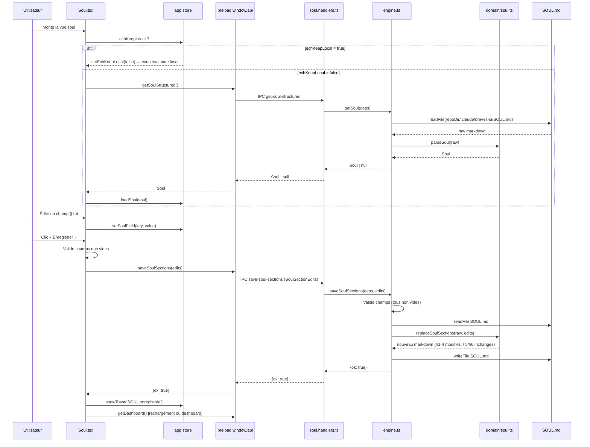
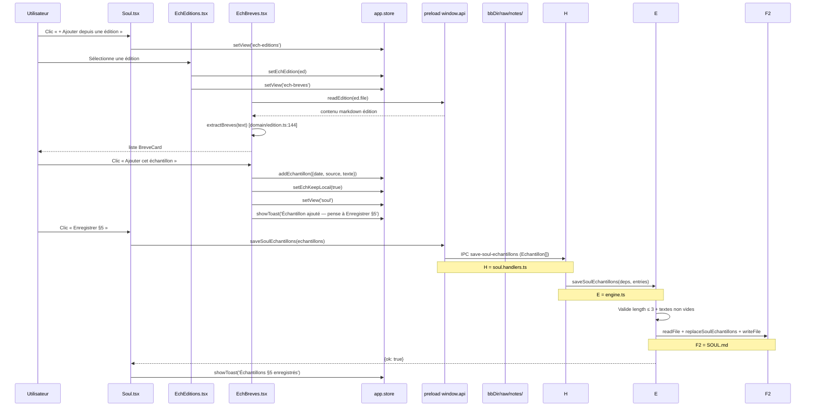

# Module soul — Architecture

> Module : soul · reverse (constat) · cartographié à `4ce7095`
> Rédigé en posture Architecte Module override reverse. Chaque assertion est tracée. Le code fait foi.
> Réfère le socle : `docs/project/architecture.md` (couches, IPC, design system, store Zustand).

---

## Périmètre architectural

Le module soul couvre **3 vues** (`soul`, `ech-editions`, `ech-breves`), **3 canaux IPC**, **1 fichier de données externe** (`SOUL.md`) et **1 couche domaine pure** (`domain/soul.ts`). Il ne gère aucun processus SDK/LLM — toutes les opérations sont des lectures/écritures synchrones de fichier Markdown.

---

## Modèle de données

### Types TypeScript (`src/domain/soul.ts`)

```typescript
// Echantillon — une brève verbatim choisie pour §5
interface Echantillon {   // soul.ts:1-5
  date: string;    // 'YYYY-MM-DD' (date de l'édition source)
  source: string;  // domaine de la source (ex. 'sakana.ai'), peut être vide
  texte: string;   // corps de la brève verbatim
}

// JournalEntry — une leçon de style datée §6
interface JournalEntry {  // soul.ts:7-10
  date: string;   // 'YYYY-MM-DD'
  texte: string;  // texte de la leçon sur une ligne
}

// Soul — résultat du parse complet du fichier SOUL.md
interface Soul {          // soul.ts:12-20
  version: string;        // 'v{journal.length + 1}' — calculé au parse (soul.ts:67)
  quiParle: string;       // corps §1 (texte libre)
  audience: string;       // corps §2
  voix: string;           // corps §3
  lignesRouges: string;   // corps §4
  echantillons: Echantillon[]; // entrées §5 (≤ 3)
  journal: JournalEntry[];     // entrées §6
}

// SoulSectionEdits — payload de save-soul-sections
interface SoulSectionEdits { // soul.ts:22-27
  quiParle: string;
  audience: string;
  voix: string;
  lignesRouges: string;
}
```

**Note :** `soul.io.ts` expose un type distinct `SoulSummary` (avec `rules[]`, `examples[]`, `lessons[]`) utilisé uniquement par le dashboard (`getDashboard` dans `engine.ts`). Le module soul lui-même utilise exclusivement `Soul` (vu `soul.handlers.ts:1`).

### Structure du fichier `SOUL.md`

Chemin résolu : `{repoDir}/.claude/breves-ia/SOUL.md` (constante `SOUL_PARTS = ['.claude', 'breves-ia', 'SOUL.md']` dans `engine.ts:25`).

```markdown
# SOUL — Brèves IA (la plume de Pierre)

## 1. Qui parle
<texte libre §1>

## 2. Audience
<texte libre §2>

## 3. Voix & tics signatures
<texte libre §3>

## 4. Lignes rouges
<texte libre §4>

## 5. Échantillons vivants
> <préambule fixe>

### [YYYY-MM-DD] · <source>
<texte verbatim>

### [YYYY-MM-DD]
<texte verbatim — source vide>

## 6. Journal d'évolution
> <préambule fixe>

- [YYYY-MM-DD] <texte de leçon>
```

**Délimiteurs parsés :**
- Sections : `^## \d+\.` (regex de split `soul.ts:30`).
- Échantillons : `^### ` dans le corps §5 (`soul.ts:41`).
- Entrées journal : `^- \[(\d{4}-\d{2}-\d{2})\] ` (`soul.ts:57`).

---

## Structure de composants

```
module soul
├── pages/
│   ├── Soul.tsx          — vue principale (§1-4 edit + §5 curation + §6 lecture)
│   ├── EchEditions.tsx   — sélection de l'édition source (sous-flux ech-*)
│   └── EchBreves.tsx     — sélection de la brève dans l'édition choisie
├── components/
│   ├── EchantillonCard.tsx — carte d'un échantillon §5 avec bouton Retirer
│   └── BreveCard.tsx       — carte d'une brève candidat à l'ajout (vu EchBreves)
│   (BreveCard est aussi utilisé dans nouvelle-edition/Editor mais appartient logiquement ici)
└── store (slices dans app.store.ts)
    ├── soulForm: SoulForm       — états éditables des 4 champs §1-4
    ├── soulVersion: string      — version affichée (ex. 'v3')
    ├── soulJournal: JournalEntry[] — §6 en lecture seule
    ├── echantillons: Echantillon[] — §5 (local avant save)
    ├── echEdition: EditionSummary | null — édition choisie dans le sous-flux
    └── echKeepLocal: boolean    — garde contre rechargement SOUL au retour sous-flux
```

### Primitives design system (socle) utilisées

`Card`, `Button`, `Textarea`, `Eyebrow`, `Text` — définies dans `src/renderer/components/ui/` (réf. socle).

---

## Séquence technique — Charger → éditer → enregistrer §1-4



---

## Séquence technique — Sous-flux ech-* (ajouter un échantillon)



---

## Gestion d'état (slices Zustand)

| Slice | Type | Valeur initiale | Actions | Trace |
|---|---|---|---|---|
| `soulForm` | `SoulForm` | `{quiParle:'',audience:'',voix:'',lignesRouges:''}` | `loadSoul`, `setSoulField` | `app.store.ts:107,144,151` |
| `soulVersion` | `string` | `''` | `loadSoul` | `app.store.ts:108,147` |
| `soulJournal` | `JournalEntry[]` | `[]` | `loadSoul` | `app.store.ts:109,148` |
| `echantillons` | `Echantillon[]` | `[]` | `loadSoul`, `addEchantillon`, `removeEchantillon`, `setEchantillons` | `app.store.ts:106,143,149,154,155` |
| `echEdition` | `EditionSummary \| null` | `null` | `setEchEdition` | `app.store.ts:110,152` |
| `echKeepLocal` | `boolean` | `false` | `setEchKeepLocal` | `app.store.ts:111,153` |

### Mécanisme `echKeepLocal` (anti-rechargement)

Au retour du sous-flux `ech-breves → soul`, la vue `Soul.tsx` remonte et son `useEffect` se déclenche. Sans garde, il appellerait `getSoulStructured()` et écraserait les échantillons ajoutés localement (non encore sauvegardés sur disque).

La guard (`Soul.tsx:36-38`) : si `echKeepLocal === true`, on réinitialise le flag à `false` et on retourne sans rechargement réseau. Le state local (`echantillons`) est ainsi préservé jusqu'au clic « Enregistrer §5 ».

---

## Dépendances inter-modules

| Dépendance | Direction | Trace |
|---|---|---|
| Module **historique** → SOUL | `ech-editions` lit `dashboard.editions` peuplé par `listEditions` | `EchEditions.tsx:8`, `engine.ts:listEditions` |
| Module **nouvelle-edition** → SOUL | L'archivage écrit §6 uniquement (`breves-archive.md`) — jamais §5 | `_REVERSE_MAP.md §4.3` |
| Module **accueil** → SOUL | `getDashboard` appelle `readSoul` (résumé, pas `parseSoul`) | `engine.ts:getDashboard`, `soul.io.ts:33` |

---

## GAPS À REMONTER (architecture)

| # | Observation | Localisation |
|---|---|---|
| GAP-S1 (réf) | Deux modèles distincts pour le même fichier : `SoulSummary` (io/soul.io) vs `Soul` (domain/soul.ts) — redondance de parsing | `soul.io.ts:4-17`, `soul.ts:12-20` |
| GAP-S4 | `loadSoul` mappe `e.source \|\| ''` (`app.store.ts:149`) — normalisation défensive non documentée (anciens formats sans `source`) | `app.store.ts:149` |
