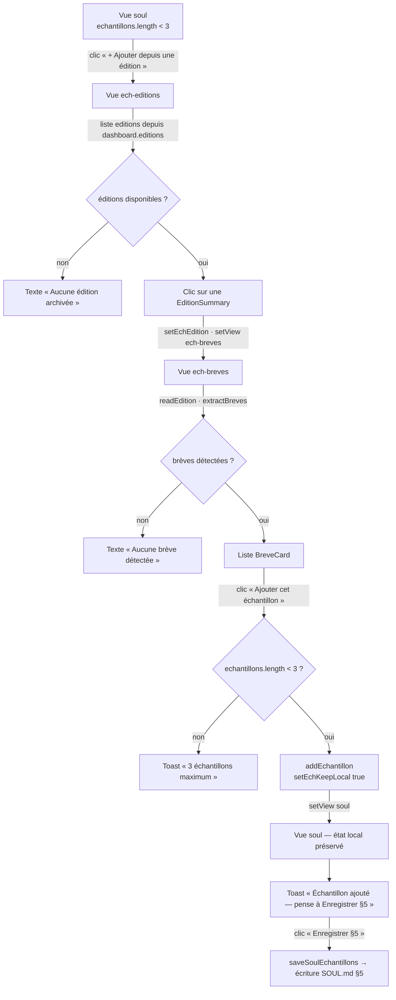

# Module soul — Spécifications fonctionnelles

> Module : soul · reverse (constat) · cartographié à `4ce7095`
> Rédigé en posture PO Module override reverse. Chaque assertion est tracée. Le code fait foi.
> Réfère le socle : `docs/project/specs.md` (contexte produit, persona, navigation globale).

---

## Périmètre du module

Le module **soul** couvre l'édition du profil éditorial SOUL : consultation et modification des §1–4 (identité, voix), curation manuelle des §5 Échantillons vivants (≤ 3), et lecture du §6 Journal d'évolution.

Données : `.claude/breves-ia/SOUL.md` (dans `repoDir`) — fichier Markdown à 6 sections.
Vues : `soul`, `ech-editions`, `ech-breves` (`src/domain/navigation.ts:1`).
Canaux IPC : `get-soul-structured`, `save-soul-sections`, `save-soul-echantillons`.

---

## User stories

### US-S1 — Éditer §1-4 et enregistrer

**En tant que** Pierre,
**je veux** modifier les sections §1 (Qui parle), §2 (Audience), §3 (Voix & tics), §4 (Lignes rouges) dans des zones de texte dédiées,
**afin de** maintenir à jour l'identité éditoriale injectée dans les prompts de rédaction.

**Critères d'acceptation** (tracés) :
- Les 4 champs sont pré-remplis au chargement de la vue `soul` depuis `window.api.getSoulStructured()` (`src/renderer/pages/Soul.tsx:40`).
- Si `getSoulStructured` retourne `null`, un toast `'SOUL introuvable.'` s'affiche (`Soul.tsx:42`).
- Le bouton « Enregistrer » est toujours actif mais lève un toast d'erreur si un champ est vide après `trim()` (`Soul.tsx:54-56`).
- Après enregistrement réussi : toast `'SOUL enregistrée'` + rechargement du dashboard (`Soul.tsx:63-65`).
- §5 et §6 ne sont **pas** modifiés par cette action (invariant vérifié `tests/main/engine.test.mjs:76`).

**Règles métier :**
- Tous les 4 champs doivent être non vides (après trim) : sinon refus sans écriture (`src/main/engine.ts:93-95`).
- Seules les sections §1–4 sont réécrites ; §5 et §6 restent inchangés bit à bit (`src/domain/soul.ts:102-120`).

---

### US-S2 — Retirer un échantillon de §5

**En tant que** Pierre,
**je veux** retirer un échantillon de la liste §5 via le bouton « Retirer » de sa carte, puis enregistrer,
**afin de** libérer une place pour un nouvel échantillon ou nettoyer la sélection.

**Critères d'acceptation** (tracés) :
- Le bouton « Retirer » sur chaque `EchantillonCard` déclenche `removeEchantillon(i)` (`Soul.tsx:107`).
- Le compteur `({echantillons.length}/3)` se met à jour immédiatement dans le store (`Soul.tsx:100`).
- L'enregistrement nécessite un clic explicite « Enregistrer §5 » (`Soul.tsx:114`).
- L'enregistrement rewrite §5 via `replaceSoulEchantillons` sans toucher §1–4 ni §6 (`soul.ts:88-100`).

---

### US-S3 — Ajouter un échantillon depuis une édition (sous-flux ech-*)

**En tant que** Pierre,
**je veux** naviguer vers une édition archivée, y choisir une brève, et l'ajouter comme échantillon §5,
**afin d'** enrichir la fenêtre de style avec un exemple récent et validé.

**Critères d'acceptation** (tracés) :
- Le bouton « + Ajouter depuis une édition » est désactivé si `echantillons.length >= 3` (`Soul.tsx:111`).
- Le clic navigue vers `ech-editions` (`Soul.tsx:111`).
- La vue `ech-editions` liste les éditions depuis `dashboard.editions` (`EchEditions.tsx:8`).
- Sélectionner une édition navigue vers `ech-breves` et stocke `echEdition` dans le store (`EchEditions.tsx:12-15`).
- La vue `ech-breves` charge les brèves via `window.api.readEdition(file)` + `extractBreves()` (`EchBreves.tsx:23-25`).
- Ajouter une brève : `addEchantillon({date: ed.date, source: b.source, texte: b.texte})` + `setEchKeepLocal(true)` + retour vers `soul` + toast (`EchBreves.tsx:43-48`).
- Au retour sur `soul`, le garde `echKeepLocal` empêche le rechargement depuis le disque, préservant l'état local (`Soul.tsx:36-38`).
- Le toast `'Échantillon ajouté — pense à « Enregistrer §5 ».'` guide l'enregistrement explicite (`EchBreves.tsx:48`).
- Si l'édition est absente (`!echEdition`), `ech-breves` redirige vers `ech-editions` (`EchBreves.tsx:17-19`).
- Le toast `'3 échantillons maximum.'` est affiché si on tente d'ajouter quand le plafond est atteint (`EchBreves.tsx:40-42`).

**Règles métier :**
- Plafond absolu de 3 échantillons : la guard est double (bouton UI désactivé + guard dans `addEchantillon` du store, `app.store.ts:154`).
- `echKeepLocal = true` est le seul mécanisme qui protège l'état local entre deux navigations dans le sous-flux (`soul.ts` render-side).
- Chaque échantillon porte : `date` (de l'édition), `source` (de la brève), `texte` (verbatim).

---

### US-S4 — Lire le journal §6

**En tant que** Pierre,
**je veux** consulter les leçons de style enregistrées au fil des éditions,
**afin de** suivre l'évolution de la plume.

**Critères d'acceptation** (tracés) :
- Le §6 est affiché en lecture seule dans `Soul.tsx:119-134`.
- Chaque entrée affiche la date (`l.date`, format SOUL `YYYY-MM-DD`) et le texte de la leçon.
- Si `soulJournal.length === 0`, un message `'Aucune leçon enregistrée.'` s'affiche.
- §6 n'est **jamais** modifiable depuis l'UI SOUL (pas de champ texte ni de bouton d'ajout) : il est alimenté uniquement par le flux d'archivage (hors périmètre de ce module — voir module `nouvelle-edition`).

**Règles métier :**
- §6 est en lecture seule dans le module soul. La gate « propose puis confirme » qui l'alimente est dans `.claude/commands/breves-archive.md` (réf. `_REVERSE_MAP.md §4.3`).
- Le versioning implicite `v{journal.length + 1}` est affiché à côté de la version dans la vue (`Soul.tsx:79`).

---

## Règles métier synthétiques

| # | Règle | Trace |
|---|---|---|
| R1 | §5 jamais modifié par l'archivage (seul le module soul écrit §5 via `save-soul-echantillons`) | `_REVERSE_MAP.md §4.3`, `engine.ts:106-118` |
| R2 | Maximum 3 échantillons — double garde UI + store | `Soul.tsx:111`, `app.store.ts:154` |
| R3 | Aucun champ §1–4 ne peut être vide (guard avant écriture) | `engine.ts:93-95`, `Soul.tsx:54-56` |
| R4 | Aucun échantillon ne peut avoir un `texte` vide | `engine.ts:108-110` |
| R5 | Versioning SOUL = `v{nb leçons §6 + 1}` — calculé au parse | `soul.ts:67` |
| R6 | §6 est alimenté uniquement via la phase d'archivage | `_REVERSE_MAP.md §4.3` |
| R7 | `echKeepLocal = true` empêche le rechargement au retour du sous-flux ech-* | `Soul.tsx:36-38`, `EchBreves.tsx:46` |

---

## Parcours Mermaid — Ajouter un échantillon depuis une édition



---

## Mockups — États par écran

### Vue `soul`

```
╔══════════════════════════════════╗
║ SOUL — La voix de Pierre [v3]    ║
╠══════════════════════════════════╣
║ 1 · Qui parle                    ║
║ [textarea — quiParle]            ║
║ 2 · Audience                     ║
║ [textarea — audience]            ║
║ 3 · Voix & tics                  ║
║ [textarea mono — voix]           ║
║ 4 · Lignes rouges                ║
║ [textarea mono — lignesRouges]   ║
║ [Enregistrer]                    ║
╠══════════════════════════════════╣
║ 5 · Échantillons vivants (2/3)   ║
║ ┌──────────────────────────────┐ ║
║ │ 24 juin 2026 · abondance.com │ ║
║ │ [texte brève]      [Retirer] │ ║
║ └──────────────────────────────┘ ║
║ [+ Ajouter depuis une édition]   ║
║ [Enregistrer §5]                 ║
╠══════════════════════════════════╣
║ 6 · Journal d'évolution          ║
║ ┌──────────────────────────────┐ ║
║ │ 2026-06-24                   │ ║
║ │ Ne jamais construire…        │ ║
║ └──────────────────────────────┘ ║
╚══════════════════════════════════╝
État vide §5 : « Aucun échantillon. Ajoute jusqu'à 3 brèves depuis tes éditions. »
État vide §6 : « Aucune leçon enregistrée. »
Bouton « + Ajouter » : disabled si 3 échantillons
```

### Vue `ech-editions`

```
╔══════════════════════════════════╗
║ Choisis l'édition d'où provient  ║
║ la brève à promouvoir en §5.     ║
║ ┌──────────────────────────────┐ ║
║ │ Vendredi 27 juin 2026        │ ║  ← button
║ │ Brèves IA #12                │ ║
║ └──────────────────────────────┘ ║
║ …                                ║
╚══════════════════════════════════╝
État vide : « Aucune édition archivée. »
```

### Vue `ech-breves`

```
╔══════════════════════════════════╗
║ 2026-06-27 · Brèves IA #12       ║
║ ┌──────────────────────────────┐ ║
║ │ [texte brève verbatim]       │ ║
║ │ [Ajouter cet échantillon]    │ ║  ← disabled si 3 max
║ └──────────────────────────────┘ ║
║ …                                ║
╚══════════════════════════════════╝
État chargement : « Chargement… »
État vide : « Aucune brève détectée dans cette édition. »
Bouton disabled : label « 3 échantillons max atteint »
```

---

## GAPS À REMONTER (module soul)

| # | Observation | Localisation |
|---|---|---|
| GAP-05 (réf) | Versioning SOUL implicite calculé en double (`soul.ts:67` ET `breves-archive.md`) | `docs/REVERSE_GAPS.md#GAP-05` |
| GAP-S1 | `soul.io.ts` (`readSoul`) et `engine.getSoul` (`parseSoul`) exposent deux modèles distincts (`SoulSummary` vs `Soul`) pour le même fichier — seul `Soul` est utilisé dans le module soul, `SoulSummary` est réservé au dashboard | `soul.io.ts:4-17`, `soul.ts:12-20` |
| GAP-S2 | Les textes des échantillons sont rendus via `inlineMd` + `dangerouslySetInnerHTML` dans `EchantillonCard` sans sanitisation complémentaire — le contenu est semi-fiable (copié de brèves archivées) | `EchantillonCard.tsx:23` |
| GAP-S3 | L'enregistrement §5 n'est pas déclenché automatiquement après l'ajout depuis le sous-flux : un toast guide l'utilisateur mais un oubli est possible (état local non persisté) | `EchBreves.tsx:48`, `Soul.tsx:114` |
