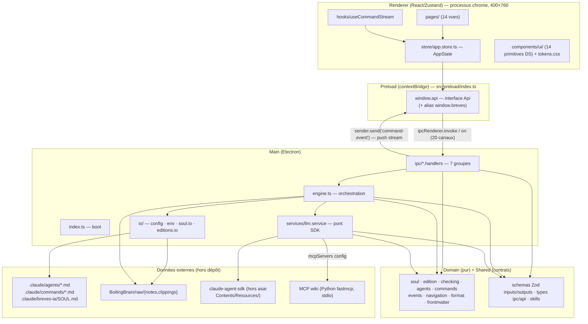
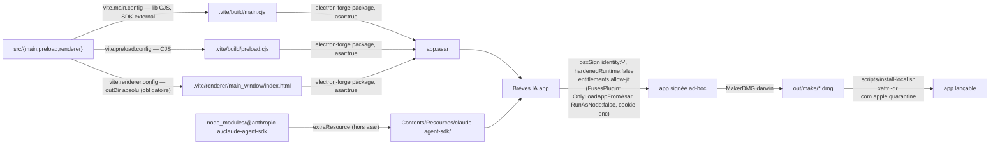
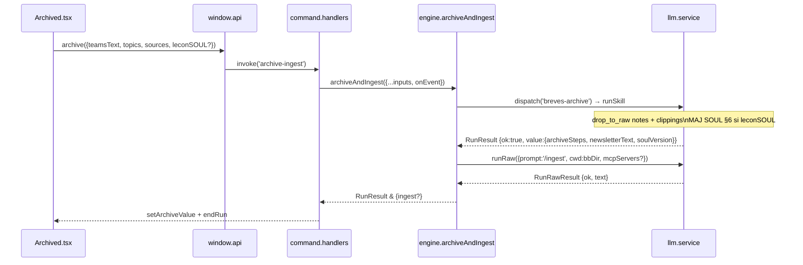

# Architecture Globale — Brèves IA

> Framework : **reverse (constat)** · cartographié à `4ce7095` (2026-06-27).
> Chaque assertion est tracée (`fichier:ligne`). Le **code fait foi**. Aucune recommandation, aucune conjecture sans trace.

---

## Choix technologiques (constatés)

| Technologie | Usage | Preuve (trace) |
|---|---|---|
| Electron 33 | Runtime desktop (main + renderer + preload), fenêtre sans frame | `package.json:47`, `src/main/index.ts:14-25` |
| React 19 + react-dom | UI du renderer | `package.json:28-29`, `src/renderer/main.tsx` |
| Zustand 5 | État global du renderer — store unique `AppState` | `package.json:31`, `src/renderer/store/app.store.ts:37-58` |
| Zod 4 | Validation Zod aux frontières (entrées et sorties des skills) | `package.json:30`, `src/shared/schemas/inputs.ts`, `src/shared/schemas/outputs.ts` |
| `@anthropic-ai/claude-agent-sdk` ^0.3.181 | Exécution des skills et des sous-agents Claude (query loop) | `package.json:27`, `src/main/services/llm.service.ts:62` |
| TypeScript 6 | Langage, mode strict, 7 alias de chemins `@main @preload @renderer @domain @shared @config @assets` | `package.json:57`, `vite.main.config.ts:21-28` |
| electron-forge 7.11 + plugin-vite | Build/packaging (3 cibles : main CJS, preload CJS, renderer) | `package.json:34-37`, `forge.config.ts:44-49` |
| Vite 6 | Bundling des 3 cibles | `vite.main.config.ts`, `vite.preload.config.ts`, `vite.renderer.config.ts` |
| Vitest 4 | Tests unitaires (env Node), 48 fichiers `.test.mjs` | `package.json:61`, `vitest.config.mjs` |
| Storybook 10 (react-vite) | Vitrine du design system (outil de dev, non embarquée) | `package.json:21-22`, `.storybook/main.ts` |
| Husky 9 | Hook pre-commit : typecheck + lint + tests | `package.json:53`, `.husky/pre-commit` |
| MCP `boiling-brain-wiki` (Python fastmcp) | Archivage (`drop_to_raw`) + ingestion wiki, processus stdio externe | `src/main/io/env.ts:44-50` |

Cible Node ≥ 22 (`package.json:6-8`, `.nvmrc`). Aucune BDD, aucun serveur HTTP, aucune couche d'authentification : **app locale mono-utilisateur macOS** (absence de couche réseau entrante confirmée dans le code).

---

## Architecture du système

### Diagramme de composants



**Frontière clé** : `renderer` et `main` ne s'importent **jamais** mutuellement (vérifié par le graphe d'imports `@alias`) — ils communiquent uniquement via le **contrat IPC** (`src/shared/types/ipc.ts`). `domain` est le noyau pur partagé des deux côtés sans dépendance Electron ni React.

### Diagramme de déploiement (packaging macOS — aucun cloud)



Traces : `forge.config.ts:9` (asar), `:10` (bundleId `com.tetra-plg.breves-ia`), `:18` (extraResource), `:23-38` (osxSign ad-hoc, hardenedRuntime:false), `:42` (MakerDMG darwin), `:53-61` (FusesPlugin). `vite.main.config.ts:18` (SDK external). `vite.renderer.config.ts:15` (outDir absolu — sans ça, fenêtre vide en prod). `scripts/install-local.sh:51-53` (retrait quarantaine obligatoire).

---

## Modèles de données (types TS + fichiers disque — aucune BDD)

Le stockage est **entièrement fichiers Markdown/JSON sur disque**. Les entités sont des types TypeScript du `domain`, sérialisées/désérialisées depuis des fichiers.

### Soul — profil éditorial (`src/domain/soul.ts`)

| Type | Champs | Trace |
|---|---|---|
| `Soul` | `version: string`, `quiParle`, `audience`, `voix`, `lignesRouges`, `echantillons: Echantillon[]`, `journal: JournalEntry[]` | `soul.ts:12-20` |
| `Echantillon` | `date`, `source`, `texte` | `soul.ts:1-5` |
| `JournalEntry` | `date`, `texte` | `soul.ts:7-10` |
| `SoulSectionEdits` | `quiParle`, `audience`, `voix`, `lignesRouges` | `soul.ts:22-27` |

Fichier : `{repoDir}/.claude/breves-ia/SOUL.md`, 6 sections `## n. …`. Parsé par `parseSoul` (`soul.ts:63`). Version dérivée : `v${journal.length + 1}` (`soul.ts:67`). Résumé léger côté main : `readSoul` (`src/main/io/soul.io.ts:33`). Mutation §1-4 via `replaceSoulSections` (`soul.ts:102`) ; §5 via `replaceSoulEchantillons` (`soul.ts:88`) — §5 **jamais touché par l'archivage**. §6 ajouté par `breves-archive`.

### Edition / Breve (newsletter archivée)

| Type | Champs | Trace |
|---|---|---|
| `Breve` | `date`, `source`, `accroche`, `texte` | `src/domain/edition.ts:114` |
| `EditionSummary` | `file`, `date`, `range`, `count`, `corr` (toujours 0, GAP-06), `title` | `src/main/io/editions.io.ts:6-13` |

Fichier : `{bbDir}/raw/notes/YYYY-MM-DD-breves-ia-merim(-slug).md`. Regex de validation `editions.io.ts:4` et `engine.ts:122` (anti-traversal). Rendu HTML : `renderEditionHtml` (`edition.ts:25`).

### Card / CheckStep (suivi de vérification — état UI volatil)

| Type | Champs | Trace |
|---|---|---|
| `Card` | `key`, `title`, `status`, `done`, `error`, `source`, `alerte`, `steps: CheckStep[]` | `src/domain/checking.ts:12-21` |
| `CheckStep` | `name: string`, `state: 'todo'|'active'|'done'` | `checking.ts:7-10` |
| `STEPS` | `['recherche','faits','date','source','article']` | `checking.ts:3` |

Volatil : reconstruit par réduction d'événements (`applyEvent:63`, `applyResult:96`). Aucune persistance disque.

### Agent / Command (configuration IA)

| Type | Champs | Trace |
|---|---|---|
| `Agent` | `name`, `description`, `tools[]`, `model`, `enabled`, `mode`, `systemPrompt` | `src/domain/agents.ts:6-14` |
| `AgentDefinition` | `description`, `prompt`, `tools[]`, `model?` | `agents.ts:16-21` |
| `Command` | `name`, `description`, `body` | `src/domain/commands.ts:3` |

Fichiers : `{repoDir}/.claude/agents/*.md` et `.claude/commands/*.md` (frontmatter YAML + corps). Anti-traversal : `isSafeName` (`engine.ts:194-196`).

### Sorties des skills (Zod)

| Schema | Champs clés | Trace |
|---|---|---|
| `verifyOutputSchema` | `{ topics: [{ key, sujet, date_reelle, fiabilite, source, url_citee, url_clippee, slug, clipping_contenu, faits[], alerte? }] }` | `src/shared/schemas/outputs.ts:14-31` |
| `draftOutputSchema` | `{ teamsText, corrections[], sources[], soulLessonProposee? }` | `outputs.ts:33-49` |
| `archiveOutputSchema` | `{ archiveSteps[], newsletterText, soulVersion }` | `outputs.ts:52-58` |

Toutes en `.passthrough()` (carry-over des champs hors-contrat). `fiabilite` ∈ `{confirme, partiel, non_verifie}` (`outputs.ts:4`).

### Config utilisateur

`UserConfig { bbDir?, repoDir?, claudeBin? }` — fichier `{userData}/config.json` (`src/main/io/config.ts:14`). Écrit au 1er lancement si vide (`index.ts:63-68`). Persisté par `save-settings` (`settings.handlers.ts:39`).

### TopicEvent / ActivityEvent (protocole de streaming)

`TopicEvent` = union `topic-detected|topic-progress|topic-done|topic-error` (`src/domain/events.ts:8-12`). `Alerte { niveau: 'corrigé'|'nuance'|'date', texte }` (`events.ts:1-6`). `ActivityEvent { type:'activity', label }` (`events.ts:14-17`).

---

## Structure du projet

```
breves-ia/
├── package.json                   # name: breves-ia-companion, version 1.0.0, engines.node >=22
├── forge.config.ts                # packaging Electron
├── vite.{main,preload,renderer}.config.ts
├── tsconfig.json                  # strict, aliases @main @preload @renderer @domain @shared @config @assets
├── vitest.config.mjs
├── build/entitlements.mac.plist   # allow-jit (hardenedRuntime désactivé)
├── scripts/
│   ├── breves-cli.ts              # CLI dev : npm run breves (hors app packagée)
│   ├── install-local.sh           # retrait quarantaine + lien /Applications
│   └── smoke-boot.mjs             # vérifie import SDK dans contexte Forge
├── .claude/
│   ├── agents/{enqueteur,sceptique,redacteur}.md  # sous-agents SDK
│   └── commands/{breves-verify,breves-draft,breves-archive}.md  # skills = slash-commands
├── src/
│   ├── config/constants.ts        # APP_NAME, WINDOW_WIDTH=400, WINDOW_HEIGHT=760
│   ├── domain/                    # logique pure — aucune dép Electron/React
│   │   ├── soul.ts               # parseSoul, replaceSoulSections, replaceSoulEchantillons
│   │   ├── edition.ts            # renderEditionHtml, extractBreves, extractJsonBlock, parseSentinels
│   │   ├── checking.ts           # STEPS, Card, initCard, applyEvent, applyResult, summary
│   │   ├── agents.ts             # parseAgent, toAgentDefinition, serializeAgent, activityFromMessage
│   │   ├── commands.ts           # parseCommand, serializeCommand
│   │   ├── events.ts             # TopicEvent, ActivityEvent, Alerte
│   │   ├── navigation.ts         # VIEWS (12), FLOW (4), nextView, stepper, viewTitle
│   │   ├── format.ts             # escapeHtml, inlineMd, dateLong
│   │   └── frontmatter.ts        # splitFrontmatter
│   ├── shared/                    # contrats partagés main ↔ renderer
│   │   ├── schemas/inputs.ts     # validateInputs, schémas Zod stricts + anti-injection
│   │   ├── schemas/outputs.ts    # validateVerifyOutput/Draft/Archive, types exportés
│   │   ├── types/api.ts          # interface Api, ApiResult, SettingsState
│   │   ├── types/ipc.ts          # IPC (20 canaux), IpcLike, IpcHandler
│   │   ├── skills.ts             # ALLOWED_SKILLS (3), buildPrompt
│   │   ├── errors.ts             # AppError
│   │   └── logger.ts             # logger console
│   ├── main/                      # processus Electron principal
│   │   ├── index.ts              # boot : loadEnvFile → readUserConfig → defaultDeps → registerAllHandlers → createWindow
│   │   ├── engine.ts             # EngineDeps, defaultDeps, applyConfig, dispatch, archiveAndIngest, CRUD SOUL/agents/commands, getDashboard
│   │   ├── services/llm.service.ts  # runSkill, runRaw, resolveSdkSpecifier, loadSdkQuery
│   │   ├── io/
│   │   │   ├── config.ts         # readUserConfig, writeUserConfig, {userData}/config.json
│   │   │   ├── env.ts            # resolveSetting (env>file>défaut), loadEngineConfig, buildWikiMcp, loadEnvFile
│   │   │   ├── soul.io.ts        # readSoul → SoulSummary
│   │   │   └── editions.io.ts    # listEditions, EditionSummary, EDITION_RE
│   │   └── ipc/
│   │       ├── index.ts          # registerAllHandlers (7 groupes)
│   │       ├── command.handlers.ts   # send-command, archive-ingest
│   │       ├── dashboard.handlers.ts # get-dashboard, read-edition
│   │       ├── soul.handlers.ts      # get-soul-structured, save-soul-sections, save-soul-echantillons
│   │       ├── agents.handlers.ts    # get-agents, save-agent
│   │       ├── commands.handlers.ts  # get-commands, save-command
│   │       ├── system.handlers.ts    # copy, open-external, hide-window, quit-app
│   │       └── settings.handlers.ts  # get-settings, validate-path, pick-path, save-settings
│   ├── preload/index.ts           # contextBridge → window.api (+ alias window.breves, rétro-compat)
│   └── renderer/                  # React
│       ├── main.tsx               # montage React
│       ├── App.tsx                # routeur view→Page (registry 14 vues) + useCommandStream unique
│       ├── layouts/Shell.tsx      # layout global (nav + slot)
│       ├── window.d.ts            # déclaration window.api
│       ├── store/app.store.ts     # store Zustand unique — AppState (view, cards, verifyValue/draftValue/archiveValue, runStatus, …)
│       ├── pages/ (14)            # Dashboard Compose Checking Detail Editor Archived Soul EchEditions EchBreves History Reader Agents Commands Settings
│       ├── components/            # composites métier (EnqCard, CorrectionRow, SourceRow, AgentCard, CommandCard, Drawer, …)
│       │   └── ui/ (14 primitives + foundations/)  # design system : Button Card Alert Badge Pill Spinner StatusDot Input Textarea Modal Stepper Text Eyebrow + MDX
│       ├── hooks/useCommandStream.ts  # abonnement onCommandEvent → applyCardEvent / setRunActivity
│       └── styles/{tokens,app}.css   # tokens.css (couches sémantiques + échelle --space), app.css
└── tests/                         # 54 fichiers .test.mjs (Vitest, env Node)
    ├── main/                      # engine, llm.service, io/, domain/
    └── renderer/stories-coverage.test.mjs  # invariant : chaque primitive ui/ a une story
```

---

## Surface IPC (20 canaux — `src/shared/types/ipc.ts`)

| Domaine | Canal | Handler (trace) | Entrée → Sortie |
|---|---|---|---|
| Pipeline | `send-command` | `command.handlers.ts:5` | `{skill, inputs}` → `RunResult` + stream `command-event` |
| Pipeline | `archive-ingest` | `command.handlers.ts:17` | `{teamsText, topics, sources, leconSOUL?}` → `RunResult & {ingest?}` |
| Dashboard | `get-dashboard` | `dashboard.handlers.ts` | `{}` → `{soul: SoulSummary|null, editions: EditionSummary[]}` |
| Dashboard | `read-edition` | `dashboard.handlers.ts` | `file: string` → `string|null` |
| SOUL | `get-soul-structured` | `soul.handlers.ts` | `{}` → `Soul` |
| SOUL | `save-soul-sections` | `soul.handlers.ts` | `SoulSectionEdits` → `{ok, error?}` |
| SOUL | `save-soul-echantillons` | `soul.handlers.ts` | `Echantillon[]` (≤3) → `{ok, error?}` |
| Agents | `get-agents` | `agents.handlers.ts` | `{}` → `Agent[]` |
| Agents | `save-agent` | `agents.handlers.ts` | `{name, edits: AgentEdits}` → `{ok, error?}` |
| Commands | `get-commands` | `commands.handlers.ts` | `{}` → `Command[]` |
| Commands | `save-command` | `commands.handlers.ts` | `{name, edits: CommandEdits}` → `{ok, error?}` |
| Système | `copy` | `system.handlers.ts` | `text: string` → clipboard |
| Système | `open-external` | `system.handlers.ts` | `url: string` (filtre `https?://`) → void |
| Système | `hide-window` | `system.handlers.ts` | `{}` → void |
| Réglages | `get-settings` | `settings.handlers.ts` | `{}` → `SettingsState` |
| Réglages | `validate-path` | `settings.handlers.ts` | `{path, kind}` → `{ok, error?}` |
| Réglages | `pick-path` | `settings.handlers.ts` | `kind: 'directory'|'file'` → `string|null` |
| Réglages | `save-settings` | `settings.handlers.ts` | `UserConfig` → `{ok, error?}` + `applyConfig` à chaud |
| Système | `quit-app` | `settings.handlers.ts` | `{}` → `app.quit()` |
| Flux push | `command-event` | `ipcRenderer.on` (preload) | `StreamEvent` → renderer (push, pas invoke) |

`preload/index.ts:34-36` : `contextBridge.exposeInMainWorld('api', api)` + alias `'breves'` (rétro-compat, voir GAP-03).

---

## Résolution de configuration (env > file > défaut)

Implémentée par `resolveSetting` (`src/main/io/env.ts:32-42`). Trois clés (`SettingKey = 'bbDir'|'repoDir'|'claudeBin'`) :

| Clé | Variable d'env | Défaut hardcodé | Usage |
|---|---|---|---|
| `bbDir` | `BREVES_BB_DIR` | `/Users/pleguern/Workspace/BoilingBrain` (`env.ts:21`) | cible archivage + MCP wiki |
| `repoDir` | `BREVES_REPO_DIR` | `/Users/pleguern/Workspace/breves-ia` (`env.ts:22`) | SOUL, agents, commands |
| `claudeBin` | `BREVES_CLAUDE_BIN` | `/Users/pleguern/.local/bin/claude` (`env.ts:23`) | binaire SDK |

MCP wiki : `buildWikiMcp` (`env.ts:44-50`) construit `{type:'stdio', command: BREVES_WIKI_PY|'/Users/pleguern/.local/pipx/venvs/fastmcp/bin/python', args:[BREVES_WIKI_SCRIPT|'{bbDir}/scripts/mcp/mcp-wiki.py']}`. Les chemins par défaut sont hardcodés sur la machine de Pierre (GAP-01).

Boot (`index.ts:44-89`) : `loadEnvFile()` → `readUserConfig(userData)` → si vide, écrit les valeurs effectives → `defaultDeps(env, userConfig)` → `registerAllHandlers` → `createWindow`.

---

## Diagrammes de séquence

### Phase 1 — Vérification (streaming live)

```mermaid
sequenceDiagram
  participant U as Compose.tsx
  participant S as store (Zustand)
  participant API as window.api
  participant H as command.handlers
  participant E as engine.dispatch
  participant L as llm.service.runSkill
  participant SDK as claude-agent-sdk

  U->>S: beginRun() ; go('launch') → view:'checking'
  U->>API: sendCommand('breves-verify', {sujets, sceptique?})
  API->>H: ipcRenderer.invoke('send-command')
  H->>E: dispatch({skill:'breves-verify', inputs, onEvent})
  note over E: injecte sceptique.mode depuis agents.md
  E->>L: runSkill({skill, inputs, bbDir:repoDir, claudeBin, mcpServers?, agents?})
  L->>L: validateInputs (Zod .strict, anti-control-chars)
  L->>L: buildPrompt → '/breves-verify\nINPUTS:…'
  L->>SDK: query({prompt, options:{cwd, permissionMode:'bypassPermissions', …}})
  loop messages assistant
    SDK-->>L: SdkMessage type:'assistant'
    L->>L: parseSentinels(text) → TopicEvent[]
    L->>L: activityFromMessage(m) → ActivityEvent[]
    L-->>H: onEvent(ev)
    H-->>API: sender.send('command-event', ev)
    API-->>S: useCommandStream → applyCardEvent / setRunActivity
  end
  SDK-->>L: SdkMessage type:'result'
  L->>L: extractJsonBlock + validateVerifyOutput (Zod .passthrough)
  L-->>H: RunResult {ok:true, value:VerifyOutput}
  H-->>S: setVerifyValue + applyResultCards
```

Traces : `Compose.tsx:41`, `command.handlers.ts:5-15`, `engine.ts:136-156`, `llm.service.ts:90-151` (options `:113-120`, validation `:144-150`), `edition.ts:218` (`parseSentinels`), `hooks/useCommandStream.ts:13-23`, `store/app.store.ts` (`applyCardEvent`, `setRunActivity`).

### Phase 3 — Archivage + ingestion wiki



Traces : `Archived.tsx:30`, `command.handlers.ts:17-32`, `engine.ts:264-281` (`archiveAndIngest`), `.claude/commands/breves-archive.md`.

---

## Le pipeline métier (3 phases)

Le flux utilisateur suit la séquence linéaire `compose → checking → editor → archived` (`src/domain/navigation.ts:6`, `FLOW`). Chaque phase déclenche un **skill** (slash-command `.claude/commands/*.md`) exécuté par le SDK, qui fan-out vers des **sous-agents** (`.claude/agents/*.md`).

### Phase 1 — Vérification (`breves-verify`)

- Entrée Zod : `{sujets: string (≤8000), sceptique?: 'off'|'ciblé'|'toujours'}` — anti control-chars sauf `\n` (`inputs.ts:24`).
- Commande : émet `«BREVES» topic <key>|<sujet>` par sujet (suivi live), fan-out ≤15 sous-agents `enqueteur` en parallèle (Task), émet jalons `step/done/error`. Passe sceptique si mode ≠ `off`.
- Sous-agents : `enqueteur` (WebSearch/WebFetch, modèle opus, vérifie faits/date/source/clipping, jamais `non_verifie` si vérifiable) ; `sceptique` (WebSearch/WebFetch, modèle sonnet, mode `ciblé` sur affirmations fortes — critère heuristique, voir GAP-08).
- Sortie Zod : `verifyOutputSchema` — `{topics:[{key, sujet, date_reelle, fiabilite, source, url_citee, url_clippee, slug, clipping_contenu, faits[], alerte?}]}` (`outputs.ts:14-31`).
- Suivi live : sentinelles `«BREVES» …` → `parseSentinels` (`edition.ts:218`) → stream `command-event` → `useCommandStream` → réduction `Card` 5 étapes (`checking.ts:63-93`).

### Phase 2 — Rédaction (`breves-draft`)

- Entrée Zod : `{topics: unknown[], feedback?: string (≤280), redacteur?: 'on'|'off'}` (`inputs.ts:29`).
- Mode `redacteur:on` → délègue au sous-agent `redacteur` (modèle opus, aucun outil, incarne la SOUL §3-5) ; sinon rédige en direct. `engine.dispatch` injecte `redacteur` depuis `byName.redacteur.enabled` (`engine.ts:143-145`).
- Sortie Zod : `draftOutputSchema` — `{teamsText, corrections[], sources[], soulLessonProposee?}` (`outputs.ts:33-49`).

### Phase 3 — Archivage (`breves-archive`)

- Entrée Zod : `{teamsText, topics: unknown[], sources: unknown[], leconSOUL?: string (≤280)}` (`inputs.ts:31-38`).
- Commande : `drop_to_raw('notes', …)` (note brève), `drop_to_raw('clippings', …)` par topic (sauf `non_verifie`/repli épuisé), MAJ SOUL §6 si `leconSOUL` (jamais §5). Puis `engine.archiveAndIngest` enchaîne `runRaw('/ingest')` via MCP wiki.
- Sortie Zod : `archiveOutputSchema` — `{archiveSteps[], newsletterText, soulVersion}` (`outputs.ts:52-58`).

### La SOUL (profil éditorial)

Fichier `{repoDir}/.claude/breves-ia/SOUL.md`, 6 sections (`## 1.` … `## 6.`) :
- §1 Qui parle · §2 Audience · §3 Voix & tics · §4 Lignes rouges · §5 Échantillons vivants (≤3, **curation manuelle exclusive**, jamais touchés à l'archivage) · §6 Journal d'évolution (leçons datées).
- Versioning implicite : `v${journal.length+1}` (`soul.ts:67`) — voir GAP-05.
- Gate UI : `wantSoulLesson` / `leconSOUL` — la §6 n'est mise à jour qu'avec confirmation utilisateur explicite.

---

## Patterns architecturaux (constatés)

- **Architecture en couches stricte** : `domain` (pur, testable seul) ← `main` / `renderer` ← données externes. `renderer` et `main` communiquent **uniquement** via le contrat IPC. Frontière de processus = contextBridge (`preload/index.ts`). Trace : graphe d'imports `@alias`, `_REVERSE_MODULE_MAP.md §1`.

- **Contrat IPC centralisé** : 20 canaux déclarés dans `shared/types/ipc.ts:1-22`, exposés par contextBridge (`preload/index.ts:34`), enregistrés en bloc par `registerAllHandlers` (`ipc/index.ts:11-25`). Pattern handlers : factory `register*Handlers(ipc, deps)`.

- **Injection de dépendances (EngineDeps)** : `defaultDeps(env, userConfig)` assemble les vraies implémentations (`engine.ts:41-56`) ; `applyConfig` recharge à chaud (`engine.ts:58-63`). Rend le moteur testable avec des deps mockées (`tests/main/engine.test.mjs`).

- **Validation Zod aux frontières** : entrées via `validateInputs` (`.strict()`, anti-injection control-chars, `inputs.ts:48`) ; sorties d'agent via `validate*Output` (`.passthrough()` pour carry-over, `llm.service.ts:144-150`). Frontières = `runSkill` et canaux IPC `send-command` / `archive-ingest`.

- **Résolution de config en cascade** : `env > file > défaut` (`resolveSetting` `env.ts:32-42`). Appliquée à chaud par `applyConfig` au `save-settings`.

- **Protocole de sentinelles `«BREVES»`** : le SDK émet des lignes texte préfixées `«BREVES»` (topic/step/done/error) ; `parseSentinels` (`edition.ts:218`) les convertit en `TopicEvent[]` streamés au renderer via `command-event` ; `applyEvent` (`checking.ts:63`) les réduit en machine d'états `Card`. `SENTINEL_STEPS` (`edition.ts:194`) duplique `STEPS` (`checking.ts:3`) — GAP-07.

- **SDK externalisé hors asar** : `@anthropic-ai/claude-agent-sdk` utilise `import.meta.url` + fork/spawn → doit vivre sur le disque réel. Externalisé (`vite.main.config.ts:18`) + `extraResource` (`forge.config.ts:18`). Résolution conditionnelle selon `app.isPackaged` (`llm.service.ts:45-57`).

- **Permissions SDK bypassées** (posture assumée) : `permissionMode:'bypassPermissions'` + `allowDangerouslySkipPermissions:true` hardcodés (`llm.service.ts:115-116`) — le SDK exécute les outils sans confirmation. App locale de confiance — voir GAP-02.

- **Design system tokenisé** : `tokens.css` (couches sémantiques + échelle `--space`) + 14 primitives `components/ui/` + invariant couverture stories↔composants (`tests/renderer/stories-coverage.test.mjs`).

---

## Cartographie technique des modules

> Découpage par sections d'app, décision PM du 2026-06-27 (`_REVERSE_MODULE_MAP.md §3`, D1-D2-D3). La complexité est modérée (~4 558 LOC TS/TSX, 149 fichiers source) et concentrée dans le renderer.

| Module | Section d'app | Périmètre code (artefacts clés) | Canaux IPC |
|---|---|---|---|
| **socle** *(transverse)* | — (fondations) | `renderer/components/ui/*` + `foundations/*` + `styles/tokens.css`, `store/app.store.ts`, `layouts/Shell.tsx`, `App.tsx`, `shared/types/{api,ipc}.ts`, `shared/{skills,errors,logger}.ts`, `main/index.ts`, `main/engine.ts`, `services/llm.service.ts`, `io/{config,env}.ts`, `domain/{frontmatter,format,navigation,events}.ts`, `preload/index.ts`, `forge.config.ts`, `vite.*.config.ts`, `build/` | tout (20) |
| **accueil** | Accueil | `pages/Dashboard.tsx`, `dashboard.handlers.ts` (get-dashboard) | `get-dashboard` |
| **nouvelle-edition** | Nouvelle édition (pipeline 3 phases) | `pages/{Compose,Checking,Detail,Editor,Archived}.tsx`, composants `{EnqCard,Drawer,RunStatus,CorrectionRow,SourceRow,CorrectModal,ArchiveStep,BreveCard}`, `command.handlers.ts`, `engine.dispatch/archiveAndIngest`, `domain/{checking,edition,events}.ts`, `shared/schemas/{inputs,outputs}.ts`, `hooks/useCommandStream.ts` | `send-command`, `command-event` (push), `archive-ingest` |
| **historique** | Historique | `pages/{History,Reader}.tsx`, composants `{HistoryRow,EditionRow}`, `dashboard.handlers.ts` (read-edition), `io/editions.io.ts`, `domain/edition.ts` (renderEditionHtml) | `read-edition` |
| **soul** | SOUL | `pages/{Soul,EchEditions,EchBreves}.tsx`, composants `{EchantillonCard,BreveCard}`, `soul.handlers.ts` (3 canaux), `io/soul.io.ts`, `domain/soul.ts` | `get-soul-structured`, `save-soul-sections`, `save-soul-echantillons` |
| **agents** | Agents | `pages/Agents.tsx`, composant `AgentCard`, `agents.handlers.ts` (2 canaux), `domain/agents.ts` | `get-agents`, `save-agent` |
| **commands** | Commandes | `pages/Commands.tsx`, composant `CommandCard`, `commands.handlers.ts` (2 canaux), `domain/commands.ts` | `get-commands`, `save-command` |
| **reglages** | Réglages | `pages/Settings.tsx`, composant `PathField`, `settings.handlers.ts` (4 canaux), `system.handlers.ts` (copy/open-external/hide-window/quit-app), `io/{config,env}.ts` | `get-settings`, `validate-path`, `pick-path`, `save-settings`, `quit-app`, `copy`, `open-external`, `hide-window` |

**Notes de frontière :**
- `dashboard.handlers.ts` porte 2 canaux distribués sur 2 modules (`get-dashboard`→accueil, `read-edition`→historique) : fichier partagé, canaux conceptuellement distincts.
- Design system reste dans `socle` (Storybook = outil dev, pas section d'app).
- Sous-flux `ech-editions`/`ech-breves` dans `soul` (alimentent §5 SOUL).
- CLI `npm run breves` (`scripts/breves-cli.ts`) = outil dev secondaire (D4), documenté dans `socle`, non embarqué dans le DMG.
- Vues `detail` et `reader` présentes dans le registry `App.tsx:26,36` mais absentes de `VIEWS` (`navigation.ts:1-4`) — atteintes par `setView` direct, hors du routeur `nextView` (GAP-04).

---

## Zones d'ombre — renvoi au registre

Registre complet : `docs/REVERSE_GAPS.md` (16 gaps, GAP-01 à GAP-16).

Récapitulatif architectural :
- **GAP-01** (config) : chemins par défaut hardcodés sur la machine de Pierre — non portables sans `.env`/Settings.
- **GAP-02** (sécurité) : `permissionMode:'bypassPermissions'` hardcodé — posture assumée, à confirmer.
- **GAP-03** (divergence) : `window.breves` résiduel annoncé retiré en Phase 4 (`preload/index.ts:36`).
- **GAP-04** (divergence) : vues `detail`/`reader` hors du routeur `nextView` (`navigation.ts` vs `App.tsx`).
- **GAP-05** (divergence) : versioning SOUL calculé en double (`soul.ts:67` + commande `breves-archive`).
- **GAP-07** (divergence) : `SENTINEL_STEPS` (`edition.ts:194`) duplique `STEPS` (`checking.ts:3`) — risque de drift.
- **GAP-10** (intention) : MCP `boiling-brain-wiki` = dépendance externe forte, non versionnée dans ce dépôt.
- **GAP-12** (sécurité) : aucune CSP, polices Google Fonts distantes (`renderer/index.html:7-12`).
