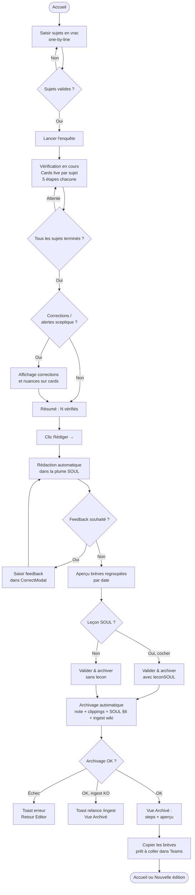
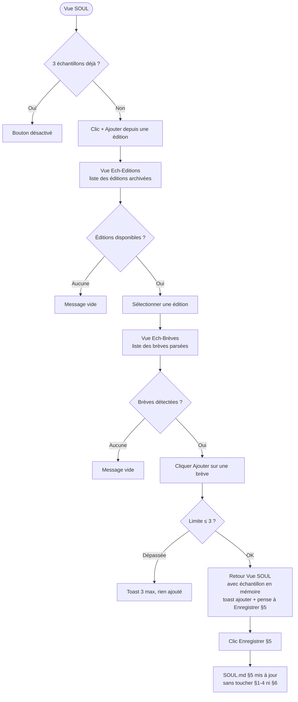

# Brèves IA — Spécifications fonctionnelles globales

> Framework : reverse (constat) · cartographié à `4ce7095`
> Rédigé en mode PO Global override reverse — chaque assertion est tracée. Le code fait foi.

---

## Contexte produit

**Brèves IA** est une application de bureau Electron mono-utilisateur (macOS, fenêtre 400 × 760 px — `src/config/constants.ts:1-3`) qui pilote le Claude Agent SDK pour produire une newsletter de brèves d'actualité IA en trois phases séquentielles : vérification → rédaction → archivage.

**Opérateur unique :** Pierre (VP Engineering / référent IA). L'app n'a ni authentification ni multi-utilisateur ; elle est locale et sans serveur (`src/main/index.ts`, `README.md`).

**Lecteurs cibles (valeur produite) :** les Product Managers de Merim, non-spécialistes IA, au travers des brèves reçues dans Teams. L'app leur est invisible ; la valeur perçue est la régularité, la fidélité à la plume de Pierre et la fiabilité factuelle.

**Garde-fou central :** l'app n'invente jamais. Tout fait non confirmé est signalé `non_verifie` dans la sortie JSON et traduit explicitement dans le texte rédigé (ex. « date non confirmée »). Source : `src/shared/schemas/outputs.ts:4`, `.claude/commands/breves-verify.md`, SOUL §4.

---

## Persona

| Attribut | Valeur (constatée) |
|---|---|
| Nom | Pierre |
| Rôle | VP Engineering, référent IA de Merim |
| Usage | Production régulière de brèves IA pour les PM de Merim |
| Contexte matériel | macOS, app locale, connexion réseau disponible pour la phase de vérification |
| Relation à l'outil | Opérateur et mainteneur — lit les brèves, corrige les sujets, édite la SOUL, gère les agents |

> Décision PM (interview transmise) : audience lecteurs = PM Merim non-spécialistes ; succès = régularité + fidélité plume + fiabilité factuelle.

---

## Sections de l'application (navigation)

L'application est structurée en **12 vues nominales** (`src/domain/navigation.ts:1-4`) + **2 vues hors-routeur** (detail, reader — atteintes par `setView` direct, non incluses dans `FLOW` ni `nextView`).

| Vue | Label header | Accessible depuis |
|---|---|---|
| `dashboard` | Accueil | Header, fin d'archivage |
| `compose` | Nouvelle édition | Dashboard (CTA), header |
| `checking` | Nouvelle édition (step 2) | Compose (launch) |
| `editor` | Nouvelle édition (step 3) | Checking (toEditor) |
| `archived` | Nouvelle édition (step 4) | Editor (validate) |
| `soul` | SOUL | Header |
| `ech-editions` | Choisir une édition | Soul (ajouter) |
| `ech-breves` | Choisir une brève | Ech-editions |
| `history` | Historique | Header, Dashboard |
| `reader` | Lecteur édition | History, Dashboard (hors-routeur) |
| `agents` | Agents | Header |
| `commands` | Commandes | Header |
| `settings` | Réglages | Header |
| `detail` | Détail sujet | Checking (hors-routeur) |

Le **FLOW linéaire** (`src/domain/navigation.ts:6`) est `compose → checking → editor → archived`. Un stepper 4 étapes (Sujets · Vérification · Rédaction · Archivé) s'affiche sur ces vues.

---

## US-01 : Voir un résumé de la SOUL et les éditions récentes (Accueil)

**En tant que** Pierre, **je veux** trouver à l'Accueil un résumé de la SOUL (version actuelle) et la liste des éditions archivées récentes, **pour** savoir où j'en suis avant de démarrer une nouvelle édition.

**Critères d'acceptance (vérifiables) :**
- L'Accueil affiche la version SOUL courante et la date de la dernière édition archivée.
  _Trace : `src/renderer/pages/Dashboard.tsx:12-24`, `window.api.getDashboard` → `dashboard.handlers.ts:5`._
- Les 4 dernières éditions archivées sont listées avec date, nombre de brèves et indicateur de corrections.
  _Trace : `Dashboard.tsx:95` (`editions.slice(0,4)`), `EditionRow`._
- Un bouton « Nouvelle édition » (CTA) navigue vers `compose`.
  _Trace : `Dashboard.tsx:35` (`go('goCompose')`)._
- Si aucune édition n'est archivée, un message « Aucune édition archivée pour l'instant. » s'affiche.
  _Trace : `Dashboard.tsx:93`._
- Si la SOUL est introuvable (fichier absent), le dashboard charge quand même ; `soul` est `null`.
  _Trace : `tests/main/engine.test.mjs:32-42` (test « getDashboard tolère une SOUL absente »)._

---

## US-02 : Saisir des sujets en vrac et lancer la vérification (Compose)

**En tant que** Pierre, **je veux** saisir mes sujets d'actualité IA en texte libre (un par ligne) et les envoyer à la vérification automatique, **pour** ne pas avoir à chercher les dates ni les URLs moi-même.

**Critères d'acceptance (vérifiables) :**
- Un champ texte multi-lignes accepte les sujets (un par ligne). Limite : ≤ 8 000 caractères, non vide, sans caractères de contrôle hors saut de ligne.
  _Trace : `src/shared/schemas/inputs.ts:12-22` (`bulkText`), `tests/shared/inputs.test.mjs:7-20`._
- Un aperçu des sujets détectés (chips, jusqu'à 8 affichés) se met à jour en saisie.
  _Trace : `Compose.tsx:22-27`._
- Le bouton « Lancer l'enquête » est désactivé si un run est déjà en cours.
  _Trace : `Compose.tsx:77` (`disabled={runActive}`)._
- Si le champ est vide ou ne contient que des espaces, un toast « Donne au moins un sujet. » s'affiche et la vérification ne démarre pas.
  _Trace : `Compose.tsx:30-34`._
- Au lancement, la vue passe immédiatement à `checking` et le statut de run passe à actif (« Vérification en cours »).
  _Trace : `Compose.tsx:39-42`._
- L'état de l'édition précédente (verifyValue, draftValue, archiveValue, cards) est réinitialisé avant chaque nouveau lancement.
  _Trace : `Compose.tsx:35-38`._

---

## US-03 : Suivre la vérification en temps réel (Checking)

**En tant que** Pierre, **je veux** voir l'avancement de chaque sujet (5 étapes : recherche, faits, date, source, article) en temps réel pendant que les enquêteurs travaillent, **pour** savoir si la vérification se déroule correctement sans attendre la fin.

**Critères d'acceptance (vérifiables) :**
- Une card par sujet détecté s'affiche dès que le sentinel `«BREVES» topic <key>` est émis (avant tout appel d'outil).
  _Trace : `src/domain/checking.ts:36-47` (`initCard`), `src/domain/edition.ts:218` (`parseSentinels`), `hooks/useCommandStream.ts`._
- Chaque card affiche 5 étapes (`recherche / faits / date / source / article`), progressant de `todo → active → done` au fil des sentinelles `«BREVES» step <key> <étape>`.
  _Trace : `src/domain/checking.ts:3`, `63-94` (`applyEvent`), `tests/domain/checking.test.mjs`._
- Une card passe au statut « Terminé » à la réception du sentinel `«BREVES» done <key>`.
  _Trace : `checking.ts:77-83`._
- Une card passe au statut « Erreur » à la réception du sentinel `«BREVES» error <key>`.
  _Trace : `checking.ts:85-92`._
- Une card peut afficher une alerte (niveau `corrigé / nuance / date`) si le sceptique a rétrogradé la fiabilité.
  _Trace : `src/shared/schemas/outputs.ts:6-9` (`alerteSchema`), `checking.ts:20`._
- Un résumé (N vérifiés · N corrigés · N nuancés) et un bouton « Rédiger les brèves » s'affichent quand tous les enquêteurs ont terminé et que `verifyValue` est disponible.
  _Trace : `Checking.tsx:18-19`, `40-55`, `src/domain/checking.ts:114-124` (`summary`)._
- Pierre peut cliquer sur une card pour ouvrir le détail du sujet (`detail`, hors-routeur).
  _Trace : `Checking.tsx:20-26`._

---

## US-04 : Consulter le détail d'un sujet vérifié (Detail)

**En tant que** Pierre, **je veux** consulter les faits vérifiés, la source, l'URL et les éventuelles corrections pour un sujet spécifique, **pour** valider manuellement avant de passer à la rédaction.

**Critères d'acceptance (vérifiables) :**
- La vue Detail est accessible depuis Checking (clic sur une card une fois `verifyValue` disponible).
  _Trace : `Checking.tsx:20-26`, `src/renderer/App.tsx:22-37`._
- Un bouton de retour permet de revenir à la vue d'origine (`returnTo`).
  _Trace : `Checking.tsx:23`, store `setReturnTo`._
- Les champs affichés incluent : sujet, date réelle, fiabilité, source, URL citée, faits, alerte (si présente).
  _Trace : `src/shared/schemas/outputs.ts:14-28` (`topicSchema`)._

---

## US-05 : Lire les brèves rédigées et apporter des corrections (Editor)

**En tant que** Pierre, **je veux** lire la rédaction produite dans ma plume (SOUL), corriger le texte si nécessaire et, le cas échéant, soumettre un feedback pour que l'agent réécrive, **pour** m'assurer que chaque édition correspond bien à mon style avant archivage.

**Critères d'acceptance (vérifiables) :**
- La rédaction démarre automatiquement au montage si aucun brouillon n'existe encore.
  _Trace : `Editor.tsx:51-59`._
- Le texte est affiché en mode aperçu (rendu HTML) par défaut, avec bascule vers mode édition directe.
  _Trace : `Editor.tsx:61-84`._
- Les corrections du sceptique (champ `corrections[]`) sont listées sous le texte (section « Corrections apportées »).
  _Trace : `Editor.tsx:97-107`, `src/shared/schemas/outputs.ts:35-39`._
- Les sources et clippings (champ `sources[]`) sont listés, avec indicateur de repli si `url_clippee ≠ url_citee`.
  _Trace : `Editor.tsx:109-116`, `src/shared/schemas/outputs.ts:39-49`._
- Un bouton « Corriger » ouvre une modale permettant de saisir un feedback textuel (≤ 280 car., sans caractères de contrôle) et de cocher « proposer une leçon SOUL ».
  _Trace : `Editor.tsx:90,120-130`, `CorrectModal.tsx`, `inputs.ts:5-11` (`freeString`)._
- Si un feedback est soumis, la rédaction repart en tenant compte du feedback. Une `soulLessonProposee` peut être générée.
  _Trace : `Editor.tsx:33-49`, `.claude/commands/breves-draft.md §3`._
- Un bouton « Valider & archiver » navigue vers `archived`.
  _Trace : `Editor.tsx:93`._

---

## US-06 : Archiver l'édition et copier les brèves (Archived)

**En tant que** Pierre, **je veux** que l'édition validée soit automatiquement archivée dans mon wiki personnel et que je puisse copier le texte prêt à coller dans Teams, **pour** clore l'édition en un minimum d'étapes.

**Critères d'acceptance (vérifiables) :**
- L'archivage démarre automatiquement au montage de la vue `archived`, une seule fois.
  _Trace : `Archived.tsx:46-54`._
- Les étapes d'archivage sont affichées (newsletter enregistrée, N clippings archivés, SOUL mise à jour, note et clippings déposés).
  _Trace : `Archived.tsx:89-95`, `src/shared/schemas/outputs.ts:54-57` (`archiveOutputSchema`)._
- Si `wantSoulLesson` est coché et qu'une `soulLessonProposee` existe, la leçon est transmise à l'archivage et ajoutée au §6 de la SOUL. Sinon, la SOUL §6 n'est pas modifiée.
  _Trace : `Archived.tsx:22-28`, `.claude/commands/breves-archive.md`._
- Les sujets `non_verifie` ou à repli épuisé ne génèrent pas de clipping ; seule l'URL est conservée dans la note.
  _Trace : `.claude/commands/breves-archive.md:15-16`._
- Si l'archivage échoue, un toast « Échec de l'archivage : … » s'affiche et la vue revient à `editor`.
  _Trace : `Archived.tsx:33-36`._
- Si l'archivage réussit mais que l'ingestion wiki échoue, un toast « Déposé dans raw/, mais l'ingestion a échoué : relance /ingest côté wiki » s'affiche (l'édition est archivée).
  _Trace : `Archived.tsx:38-40`._
- Un bouton « Copier les brèves (prêt à coller) » copie `newsletterText` dans le presse-papier et affiche un toast de confirmation.
  _Trace : `Archived.tsx:56-59`._
- Le dashboard est rafraîchi après archivage (la nouvelle édition apparaît sans redémarrage).
  _Trace : `Archived.tsx:42-43`._

---

## US-07 : Éditer la voix éditoriale (SOUL §1-4)

**En tant que** Pierre, **je veux** modifier les 4 sections de ma SOUL (Qui parle, Audience, Voix & tics, Lignes rouges) et les enregistrer, **pour** affiner ma plume au fil du temps.

**Critères d'acceptance (vérifiables) :**
- La vue SOUL charge les sections §1 à §4 depuis le fichier `.claude/breves-ia/SOUL.md` au montage (sauf retour du sous-flux échantillons, où le contenu local est conservé).
  _Trace : `Soul.tsx:34-43`, `window.api.getSoulStructured` → `soul.handlers.ts:6`._
- Chaque section est éditable dans un textarea distinct. Le bouton « Enregistrer » est actif.
  _Trace : `Soul.tsx:80-95`._
- Si l'une des 4 sections est vide ou ne contient que des espaces, l'enregistrement est bloqué et un toast « Les 4 sections doivent être remplies. » s'affiche.
  _Trace : `Soul.tsx:53-57`, `tests/main/engine.test.mjs:78-83` (test « saveSoulSections refuse un champ vide »)._
- Les sections §5 et §6 ne sont pas modifiables via ce formulaire.
  _Trace : `Soul.tsx:11-16` (SOUL_FIELDS contient uniquement §1-4)._
- La version de la SOUL (`vN`) est affichée dans la vue.
  _Trace : `Soul.tsx:21`, `src/domain/soul.ts:67`._
- Un toast « SOUL enregistrée » confirme la sauvegarde réussie.
  _Trace : `Soul.tsx:63-65`._

---

## US-08 : Gérer les échantillons de style SOUL §5 (EchEditions / EchBreves)

**En tant que** Pierre, **je veux** ajouter jusqu'à 3 brèves validées comme échantillons de style (§5 de la SOUL) en les choisissant dans mes éditions archivées, **pour** que les rédacteurs IA aient des exemples concrets de ma plume.**

**Critères d'acceptance (vérifiables) :**
- La vue SOUL affiche les échantillons §5 courants (0 à 3) avec un bouton « + Ajouter depuis une édition » (désactivé si 3 échantillons déjà présents).
  _Trace : `Soul.tsx:97-116`._
- « + Ajouter » navigue vers `ech-editions` qui liste toutes les éditions archivées.
  _Trace : `EchEditions.tsx`, `Soul.tsx:111` (`setView('ech-editions')`)._
- Sélectionner une édition navigue vers `ech-breves` qui parse et liste les brèves de l'édition.
  _Trace : `EchBreves.tsx:13-31`, `src/domain/edition.ts:144` (`extractBreves`)._
- Cliquer « Ajouter » sur une brève l'insère dans la liste locale §5, retourne à `soul` avec un toast « Échantillon ajouté — pense à "Enregistrer §5". ».
  _Trace : `EchBreves.tsx:37-48`._
- Si 3 échantillons sont déjà présents, cliquer « Ajouter » affiche un toast « 3 échantillons maximum. » sans ajouter.
  _Trace : `EchBreves.tsx:38-40`._
- Le bouton « Enregistrer §5 » écrit les échantillons dans la SOUL. Un tableau de plus de 3 échantillons ou un texte vide est refusé.
  _Trace : `Soul.tsx:68-71`, `tests/main/engine.test.mjs:178-185`._
- L'archivage ne touche jamais §5 : la curation est exclusivement manuelle via ce flux.
  _Trace : `.claude/commands/breves-archive.md:18`, `tests/main/engine.test.mjs:76` (test « §5 toujours présente »)._

---

## US-09 : Lire le journal d'évolution SOUL §6

**En tant que** Pierre, **je veux** consulter le journal des leçons de style apprises (§6), **pour** comprendre l'évolution de ma plume dans le temps.

**Critères d'acceptance (vérifiables) :**
- La section §6 est affichée dans la vue SOUL, en lecture seule, sous les échantillons §5.
  _Trace : `Soul.tsx:119-134`._
- Chaque entrée affiche la date et le texte de la leçon.
  _Trace : `Soul.tsx:125-131`._
- Si aucune leçon n'est enregistrée, le message « Aucune leçon enregistrée. » s'affiche.
  _Trace : `Soul.tsx:122`._
- Le §6 est alimenté uniquement par l'archivage (gate « propose puis confirme » dans l'Editor), jamais manuellement ni automatiquement.
  _Trace : `.claude/commands/breves-archive.md:18`, `Archived.tsx:22-28`._

---

## US-10 : Éditer les agents IA (Agents)

**En tant que** Pierre, **je veux** visualiser et modifier le prompt système, le modèle, les outils et le statut d'activation des sous-agents (enquêteur, rédacteur, sceptique), **pour** affiner leur comportement sans toucher aux fichiers `.md` directement.

**Critères d'acceptance (vérifiables) :**
- La vue Agents liste tous les agents trouvés dans `.claude/agents/*.md`, triés par nom.
  _Trace : `Agents.tsx:14-16`, `tests/main/engine.test.mjs:128-135`._
- Chaque agent peut être édité (prompt système, modèle, outils, activation) et sauvegardé.
  _Trace : `AgentCard.tsx`, `window.api.saveAgent` → `agents.handlers.ts:6`._
- Un prompt vide (ou ne contenant que des espaces) est refusé ; l'enregistrement n'a pas lieu.
  _Trace : `tests/main/engine.test.mjs:150-155`._
- Un nom contenant un séquence de traversal (`..`, `/`) est rejeté (anti path-traversal).
  _Trace : `src/main/engine.ts:194` (`isSafeName`), commit `4ce7095`._
- Un toast « Agent "X" enregistré » confirme la sauvegarde réussie ; « Échec : … » en cas d'erreur.
  _Trace : `Agents.tsx:22-24`._
- Si aucun agent n'est trouvé, le message « Aucun agent dans .claude/agents/. » s'affiche.
  _Trace : `Agents.tsx:33`._

---

## US-11 : Éditer les slash-commands (Commandes)

**En tant que** Pierre, **je veux** visualiser et modifier le contenu et la description des commandes brèves (`breves-verify`, `breves-draft`, `breves-archive`), **pour** ajuster leurs instructions sans éditeur de texte externe.

**Critères d'acceptance (vérifiables) :**
- La vue Commandes liste toutes les commandes trouvées dans `.claude/commands/*.md`.
  _Trace : `Commands.tsx:14-16`, `window.api.getCommands` → `commands.handlers.ts:5`._
- Chaque commande peut être éditée (description, corps) et sauvegardée.
  _Trace : `CommandCard.tsx`, `window.api.saveCommand` → `commands.handlers.ts:6`._
- Un nom contenant un séquence de traversal est rejeté (même garde que pour les agents).
  _Trace : `src/main/engine.ts:194` (`isSafeName`)._
- Un toast confirme la sauvegarde ou signale l'échec.
  _Trace : `Commands.tsx:22-24`._
- Si aucune commande n'est trouvée, le message « Aucune commande dans .claude/commands/. » s'affiche.
  _Trace : `Commands.tsx:33`._

---

## US-12 : Configurer les chemins de l'application (Réglages)

**En tant que** Pierre, **je veux** configurer les trois chemins de l'app (dossier BoilingBrain, dossier repo Brèves, binaire claude), **pour** pouvoir changer d'environnement ou corriger un chemin erroné.

**Critères d'acceptance (vérifiables) :**
- La vue Réglages affiche les trois champs (`bbDir`, `repoDir`, `claudeBin`) avec leur valeur courante et un indicateur de validité.
  _Trace : `Settings.tsx:10-13`, `window.api.getSettings` → `settings.handlers.ts:30`._
- Les champs verrouillés (source `env`) sont affichés en lecture seule (variable d'environnement prioritaire).
  _Trace : `Settings.tsx:75`, `tests/main/settings.handlers.test.mjs:16-20`._
- Un bouton de navigation de fichier/dossier (browse) permet de choisir le chemin via le sélecteur natif.
  _Trace : `Settings.tsx:37-39`, `window.api.pickPath` → `settings.handlers.ts:37`._
- La validité du chemin est vérifiée en temps réel (dossier ou fichier existant).
  _Trace : `Settings.tsx:32-35`, `window.api.validatePath` → `settings.handlers.ts:32`._
- Si un chemin invalide est soumis, l'enregistrement échoue et rien n'est persisté.
  _Trace : `tests/main/settings.handlers.test.mjs:42-50`._
- Si tous les chemins sont valides, l'enregistrement réussit, les chemins sont appliqués à chaud (sans redémarrage), et le dashboard est rafraîchi.
  _Trace : `Settings.tsx:50-51`, `tests/main/settings.handlers.test.mjs:29-39`._
- Un toast « Réglages enregistrés » ou « Échec : … » confirme le résultat.
  _Trace : `Settings.tsx:49`._

---

## US-13 : Consulter l'historique des éditions archivées (Historique)

**En tant que** Pierre, **je veux** voir la liste complète de mes éditions archivées, triées par date, **pour** retrouver une édition passée et la relire ou copier son texte.**

**Critères d'acceptance (vérifiables) :**
- La vue Historique liste toutes les éditions issues de `{bbDir}/raw/notes/*.md` (via `io/editions.io.ts`).
  _Trace : `History.tsx:3`, `src/main/io/editions.io.ts:21-40`._
- Chaque édition affiche date, titre (si disponible), nombre de brèves.
  _Trace : `HistoryRow`, `EditionSummary`._
- Cliquer sur une édition ouvre le Lecteur (`reader`, hors-routeur).
  _Trace : `History.tsx:18`, `store.openReader`._
- Si aucune édition n'est archivée, le message « Aucune édition archivée. » s'affiche.
  _Trace : `History.tsx:14`._

---

## US-14 : Relire et copier une édition archivée (Lecteur)

**En tant que** Pierre, **je veux** relire le texte d'une édition passée rendu en HTML et pouvoir le copier dans le presse-papier, **pour** le repartager ou vérifier un contenu.

**Critères d'acceptance (vérifiables) :**
- Le Lecteur charge le texte de l'édition depuis `{bbDir}/raw/notes/{file}` et le rend en HTML.
  _Trace : `Reader.tsx:14-31`, `src/domain/edition.ts:25` (`renderEditionHtml`), `window.api.readEdition`._
- Seuls les fichiers au format `YYYY-MM-DD-breves-ia-merim.md` sont lisibles (anti path-traversal).
  _Trace : `tests/main/engine.test.mjs:49-56`._
- Si le fichier est introuvable, le message « Texte introuvable dans le wiki (raw/notes/{file}). » s'affiche.
  _Trace : `Reader.tsx:56`._
- Un bouton « Copier » copie le texte brut dans le presse-papier avec un toast de confirmation.
  _Trace : `Reader.tsx:36-39`._

---

## Parcours principal : Nouvelle édition (de la saisie à la copie)

---

## Parcours secondaire : Ajouter un échantillon SOUL depuis une édition

---

## Règles métier

### RMB-01 : Garde-fou anti-invention (central)
L'app n'invente jamais. Si un fait n'est pas confirmé par une source accessible, `fiabilite` est `non_verifie` et le texte rédigé le signale explicitement. Aucune brève ne peut affirmer un fait `non_verifie` comme certain.
_Trace : `src/shared/schemas/outputs.ts:4` (enum `fiabilite`), SOUL §4, `.claude/commands/breves-verify.md §Garde-fous`, `.claude/agents/enqueteur.md:14`._

### RMB-02 : Plafond de sujets
La vérification traite au maximum 15 sujets en parallèle. Au-delà, seuls les 15 premiers sont traités et `avertissement_lot: true` est ajouté au JSON de sortie.
_Trace : `.claude/commands/breves-verify.md:17`._
> Note : cette limite est appliquée en prose dans le prompt, pas par validation Zod côté code (voir GAP-09).

### RMB-03 : Zéro tiret cadratin dans les brèves
Ni `—` ni `–` ne doivent apparaître dans le texte des brèves rédigées. Les deux-points, parenthèses et virgules sont les substituts autorisés. Seuls les séparateurs de section `— date —` font exception (marqueurs de structure, non du texte rédigé).
_Trace : SOUL §3, `.claude/commands/breves-draft.md:31,40`._

### RMB-04 : Regroupement par date
Les brèves sont regroupées sous un titre de section `— <date en toutes lettres, français> —` par `date_reelle`, en ordre chronologique.
_Trace : `.claude/commands/breves-draft.md:30-31`._

### RMB-05 : Clipping conditionnel
Un clipping est archivé pour chaque topic sauf si `fiabilite == non_verifie` ou si le repli source est épuisé.
_Trace : `.claude/commands/breves-archive.md:14-16`._

### RMB-06 : Repli source en cas de paywall/403
Si la source principale est inaccessible (paywall, 403, timeout), l'enquêteur bascule automatiquement vers une source accessible équivalente. L'URL citée d'origine est conservée dans le JSON ; `url_clippee ≠ url_citee` et `repli: true` dans `sources[]`.
_Trace : `.claude/agents/enqueteur.md:4`, `.claude/commands/breves-verify.md §Garde-fous`._

### RMB-07 : §5 SOUL jamais modifié par l'archivage
L'archivage ne touche jamais la section §5 (Échantillons vivants). Sa curation est exclusivement manuelle via le flux SOUL → Ech-Editions → Ech-Brèves.
_Trace : `.claude/commands/breves-archive.md:18`, `tests/main/engine.test.mjs:76`._

### RMB-08 : Versioning implicite de la SOUL
La version SOUL est `v{nb_leçons_§6 + 1}`, calculée après chaque mise à jour du §6. Pas de champ de version explicite.
_Trace : `src/domain/soul.ts:67`, `.claude/commands/breves-archive.md:19`._
> Divergence : le calcul est dupliqué côté domain et côté commande (voir GAP-05).

### RMB-09 : Gate « propose puis confirme » pour §6
La leçon SOUL n'est ajoutée au §6 que si Pierre a coché l'option dans la modale de correction et si une `soulLessonProposee` a été générée. L'archivage ne modifie jamais §6 sans cette confirmation explicite.
_Trace : `Archived.tsx:22-28`, `.claude/commands/breves-archive.md:18`, SOUL §6._

### RMB-10 : Anti path-traversal (noms de fichiers)
Les noms d'agents et de commandes ne peuvent pas contenir `..` ou `/`. Les noms de fichiers d'édition doivent correspondre au pattern `YYYY-MM-DD-breves-ia-merim.md`.
_Trace : `src/main/engine.ts:194` (`isSafeName`), `tests/main/engine.test.mjs:49-53`, commit `4ce7095`._

### RMB-11 : Passe sceptique (mode ciblé par défaut)
En mode `ciblé`, le sceptique n'est dispatché que sur les affirmations à forte assertion (chiffre, superlatif, « premier/record/jamais »). Ce critère est évalué par l'agent LLM sans règle déterministe.
_Trace : `.claude/commands/breves-verify.md:22-27`, `.claude/agents/sceptique.md`, GAP-08._

---

## Cas d'erreur et messages

| Situation | Où | Message / comportement constaté | Trace |
|---|---|---|---|
| Sujets vides au lancement | Compose | Toast « Donne au moins un sujet. » — pas de navigation | `Compose.tsx:30-34` |
| Échec de la vérification (skill KO) | Compose | Toast « Échec de la vérification : {erreur} » | `Compose.tsx:43-45` |
| Sujet non vérifiable | Checking / JSON verify | `fiabilite: non_verifie`, signalé dans le texte rédigé | `outputs.ts:4`, `breves-draft.md:36` |
| Source paywall / 403 | Vérification | Repli automatique ; `url_clippee ≠ url_citee` ; `repli: true` dans sources | `enqueteur.md:4` |
| > 15 sujets soumis | Breves-verify | `avertissement_lot: true` ; seuls les 15 premiers traités | `breves-verify.md:17` |
| Échec de la rédaction (skill KO) | Editor | Toast « Échec de la rédaction : {erreur} » | `Editor.tsx:40-42` |
| Champ feedback invalide (> 280 car. ou contrôle) | Editor / Zod | Refus Zod — pas de navigation | `inputs.ts:5-11` |
| Échec de l'archivage (skill KO) | Archived | Toast « Échec de l'archivage : {erreur} » + retour Editor | `Archived.tsx:33-36` |
| Archivage OK mais ingest wiki KO | Archived | Toast « Déposé dans raw/, mais l'ingestion a échoué : relance /ingest côté wiki » | `Archived.tsx:38-40` |
| SOUL introuvable au chargement | Soul | Toast « SOUL introuvable. » | `Soul.tsx:41` |
| Section SOUL §1-4 vide | Soul | Toast « Les 4 sections doivent être remplies. » — pas d'écriture | `Soul.tsx:53-57` |
| > 3 échantillons §5 | Soul / EchBreves | Toast « 3 échantillons maximum. » — pas d'ajout | `EchBreves.tsx:38-40` |
| Chemin invalide en Réglages | Settings | Indicateur `valid=false` par champ ; enregistrement bloqué, rien persisté | `Settings.tsx:32-35`, `settings.handlers.test:42-50` |
| Nom agent/commande avec traversal | Agents / Commands | `isSafeName` retourne `false` → `ok: false` | `engine.ts:194` |
| Agent prompt vide | Agents | `ok: false`, pas d'écriture | `engine.test.mjs:150-155` |
| Fichier édition hors pattern | Reader | `readEdition` retourne `null`, message « Texte introuvable… » | `engine.test.mjs:49-53` |

---

## Spécifications transverses

### Navigation
- **Architecture :** store Zustand unique avec `view` comme état de navigation. `go(action)` est le point d'entrée nominale ; `setView(vue)` est utilisé pour les transitions directes (sous-flux échantillons, détail, reader).
  _Trace : `store/app.store.ts:118`, `navigation.ts:10-15`._
- **Header :** les sections principales (Accueil, Nouvelle édition, Historique, SOUL, Agents, Commandes, Réglages) sont accessibles depuis le header en permanence.
  _Trace : `layouts/Shell.tsx`, `App.tsx`._
- **FLOW linéaire :** `compose → checking → editor → archived` est le seul chemin guidé par `nextView`. Les transitions hors-FLOW (soul, history, agents, commands, settings) sont directes.
  _Trace : `navigation.ts:6`, `ACTIONS`._

### Design system
- **Thème :** clair et sombre constatés (`styles/tokens.css` — couches sémantiques). Le sélecteur de thème n'est pas visible dans l'UI constatée (aucun toggle identifié dans les pages).
- **Primitives UI :** 14 composants (`Button`, `Card`, `Alert`, `Badge`, `Pill`, `Spinner`, `StatusDot`, `Input`, `Textarea`, `Modal`, `Stepper`, `Text`, `Eyebrow`, foundations MDX). Chacun a des stories et un test.
  _Trace : `src/renderer/components/ui/`, `tests/renderer/stories-coverage.test.mjs`._
- **Fenêtre fixe :** 400 × 760 px.
  _Trace : `src/config/constants.ts:1-3`._

### Authentification
Sans objet — application locale mono-utilisateur, pas d'auth, pas de session, pas de rôle.

### Accessibilité
Non spécifiée dans le sillage. Aucun critère WCAG constaté dans le code.

---

## Contraintes non-fonctionnelles

| Contrainte | Valeur constatée | Trace |
|---|---|---|
| Plateforme | macOS, app de bureau Electron (DMG ad-hoc) | `forge.config.ts`, `build/entitlements.mac.plist` |
| Runtime Node | ≥ 22 (`engines.node`) | `package.json:6-8`, `.nvmrc` |
| Fenêtre | 400 × 760 px (non redimensionnable constaté) | `src/config/constants.ts:1-3` |
| Mode offline | Partiel — la vérification (Phase 1) et l'ingest wiki (Phase 3) nécessitent le réseau | `_REVERSE_MAP.md §1`, GAP-10 |
| Dépendance réseau Phase 1 | WebSearch/WebFetch par les sous-agents enquêteur et sceptique | `.claude/agents/enqueteur.md`, `.claude/agents/sceptique.md` |
| Dépendance réseau Phase 3 | MCP `boiling-brain-wiki` + script Python dans `bbDir` pour l'ingest | `src/main/io/env.ts:44-50`, GAP-10 |
| SDK Claude | `@anthropic-ai/claude-agent-sdk` ^0.3.181, externalisé hors asar | `package.json:26`, `forge.config.ts:13-18` |
| Permissions SDK | `bypassPermissions` hardcodé (app locale de confiance) | `llm.service.ts:113-121`, GAP-02 |
| Qualité | Pre-commit Husky (typecheck + lint + tests Vitest) | `.husky/pre-commit` |
| Tests | 54 fichiers `.test.mjs` (Vitest, Node env) ; pas de CI cloud constaté | `vitest.config.mjs`, GAP-16 |
| Signature macOS | Ad-hoc (`identity: '-'`), hardened-runtime désactivé, quarantaine à retirer avant 1er lancement | `forge.config.ts:19-39`, mémoire projet `macos-signing-quarantine.md` |

---

## GAPS À REMONTER

Les points ci-dessous sont issus de `docs/REVERSE_GAPS.md` et sont pertinents pour les lecteurs de ce document. Ils ne sont pas documentés comme des features livrées mais comme des zones d'ombre en attente d'arbitrage.

| # | Type | Observation condensée | À trancher par |
|---|---|---|---|
| GAP-02 | sécurité | `permissionMode:'bypassPermissions'` hardcodé — intentionnel pour app locale de confiance, mais non documenté comme posture assumée | PM / Security |
| GAP-05 | divergence | Versioning SOUL calculé en double (`soul.ts:67` ET `breves-archive.md`) — risque de drift | PM / Lead Dev |
| GAP-08 | intention | Critère d'activation du sceptique « ciblé » laissé au jugement LLM, sans règle déterministe | PM |
| GAP-09 | edge-case | Plafond 15 sujets appliqué en prose (prompt), non validé côté Zod — limite douce | PM / Lead Dev |
| GAP-10 | intention | Dépendance MCP `boiling-brain-wiki` non versionnée dans ce dépôt — ingest inopérant sans `bbDir` configuré et script Python présent | PM / Architecte |
| GAP-16 | tests | Pas de CI cloud, aucun seuil de couverture configuré, pages React non testées directement | QA |
| GAP-04 | divergence | Vues `detail` et `reader` absentes de `const VIEWS` mais bien câblées (`App.tsx`) — modèle de routeur partiel | Lead Dev |
| GAP-06 | dead-code | `EditionSummary.corr` toujours à `0` (jamais calculé) — compteur de corrections affiché dans le dashboard mais non fonctionnel | Lead Dev |
